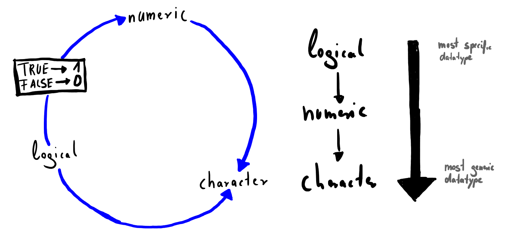

# Data Types

> There are only 10 types of people in the world: those who understand binary, and those who don't.  
> -- Anonymous

We already talked about different data structures like vectors, matrices and data frames we can use in R. Now it's time to dig a little deeper and strengthen our understanding of more basic data organization concepts before we come back to data types, high-level data structures and how to work with real-life data in R.

## Fixed and Floating Point Number Representation
Before we look at the actual data types lets get a bit technical and explore how computers deal with numbers. The numbers we normally use are called decimal numbers, which are basically numbers with a base of $b = 10$. Thus, we can deconstruct any real number $x \in \mathbb{R}$ into an (infinite) sum of powers to our base $b$. Let's look at an example:

\[ 42.125 = x = 4 \cdot 10^{1} + 2 \cdot 10^{0} + 1 \cdot 10^{-1} + 2 \cdot 10^{-2} + 5 \cdot 10^{-3}\]

While numbers in the decimal system can be conveniently processed by humans, computers work differently. In order to store them in memory, we have to perform a base switch with our chosen number $x$ and rewrite it in binary notation, where $b = 2$ and therefore only the digits 0 (absence of electrical current) and 1 (presence of electrical current) exist. We know that $42.125 = 32 + 8 + 2 + 0.125$, which leads to the following:

\[ 42.125 = x = 1 \cdot 2^{5} + 0 \cdot 2^{4} + 1 \cdot 2^{3} + 0 \cdot 2^{2} + 1 \cdot 2^{1} + 0 \cdot 2^{0} + 0 \cdot 2^{-1} + 0 \cdot 2^{-2} + 1 \cdot 2^{-3} \]

When we write the digits down it becomes clear that $42.125_{b = 10}$ equals $101010.001_{b =2}$. The representation we just discussed is called fixed point representation. Computers use a very similar version to handle real numbers called floating point representation. This is a combination of storing the algebraic sign, numbers in the binary system and moving the 'decimal' point while storing how many digits it has been moved and storing the algebraic sign. After this deconstruction our chosen number $x$ in the decimal system looks like this:

\[ 42.125 = x = (-1)^{0} \cdot 4.2125 \cdot 10^{1}\]

All we have to do now is convert everything in binary again. For compatibility purposes we also need to come up with a standard, meaning how many binary digits (bits) we want to use for the sign, the actual number, and the exponent. The usual convention is 32 bit for single precision numbers divided into 1 bit for the sign, 8 bits for the exponent and 23 bits for the actual number (called mantissa) the convention for double precision numbers 64 bit with 1 bit for the sign, 11 bits for the exponent and 52 bits for the mantissa.

<!--
The floating point representation can also be used to store very small numbers, which requires a negative exponent while we can only model positive ones, we also need to come up with a convention to solve this issue. This is usually achieved by dividing the range of the exponent into two equal parts by subtracting half of the representable value domain. As in our case the maximum value for the exponent equals $2^{11} - 1 = 2047$ we simply subtract $1023$. If we consider all this, we end up with a standard called IEEE 754, which codes a decimal number in binary exactly like discussed. Formalized and with $b=2$ this looks like this:

\[ x = (-1)^s \cdot (1+f) \cdot 2^{(e - 1023)} \]

Whereby $e$ stands for the exponent, $s$ for the sign and $f$ for the floating point number. We now only have two special cases left for which we need a convention, this is the case when our number has the value $0$ or is greater than the biggest value we can model with this binary notation. When our number equals zero the exponent $e=1023$ so that a final exponent of $0$ results and when the number is bigger than what we can model with this standard the exponent is set to $e = 2047$ which stands for infinity. In combination with the sign bit, we are pretty much done and can store what we need for our calculations.
-->

By only having a fixed amount of bits to form a number it should be obvious that using such a coding comes at a cost. This cost is usually precision. The value domain covers only a specific area and quickly comes to its limits when it comes to irrational numbers. Having a basic idea of how a computer codes decimal numbers it should be clear that there is the need for different data types in R, which means we can now start to look at the elementary data types our software environment provides. If you want a deep dive on pitfalls when it comes to floating point arithmetic you should have a look at the article called [What every Computer Scientist should know about floating-point Arithmetic](http://www.itu.dk/~sestoft/bachelor/IEEE754_article.pdf) which is freely available.


## Numeric
Atomic vectors, which are the base element of all higher order data structures can be of different types or modes. The mode is a mutually exclusive classification of objects according to their basic structure. The atomic modes are numeric, complex, logical, factors and character. A single object, even if not atomic, can only have a single mode. You can look up the mode using the command `mode()`.

The atomic mode `numeric` can be divided into two types, one for natural numbers, called `integer` and one for floating point numbers called `double`. As of now the reasons why these two cases were separated should be obvious - it is quite easy and memory efficient to store a natural number as we do not need an exponent and the whole set of conventions we discussed earlier. Contrary to this, it is quite complex to store a floating point number, which consumes - dependent on our desired precision - more bits and therefore more memory. Let's have a quick look at what R has to offer here:

```{r}
vec <- 1:5
mode(vec)
typeof(vec)
sequence <- seq(1 , 5 , by=.5)
typeof(sequence)

# Mixing integers and doubles will produce a vector of type double
mixed <- c(1:5 , seq(1 , 5 , by=.5))
typeof(mixed)         
```

Generally, R stores numbers as `double` and will use integers only when easily applicable or if you specifically force R to treat a number as an integer using the `as.integer()` command. A vector of type integer uses less memory than a vector of type double with the same length. The reason for this is the internal representation of numbers we discussed at the beginning of this chapter.
 
## Complex
R can handle complex numbers. It is doubtful that you will come across them when doing simple data analysis, but likely if you are performing more advanced calculations for e.g. in time series analysis. You can simply create a complex vector by adding an imaginary term to a real number.

```{r}
num <- sqrt(as.complex(-64))
typeof(num)

num <- 1 + 2i
typeof(num)
is.complex(num)

Re(num)                 # Returns real part of a complex number
Im(num)                 # Returns imaginary part of a complex number
```

To perform more calculations or obtain more information when dealing with complex numbers you can also use `Mod()` for the modulus and `Arg()` for the argument of a given complex number.

## Logical
Logicals can hold the value `TRUE` or `FALSE` and are often the output of comparisons. To fulfill your need for typing efficiency when programming R allows you to abbreviate `TRUE` and `FALSE` by `T` respectively `F`.

```{r}
x <- TRUE
x

1 > 5

bool <- c(T, F, T, F, T)
bool

sum(bool)               # ATTENTION: Automatic conversion to 1 (T) and 0 (F)
```

When using `TRUE` and `FALSE` in calculations they are automatically converted into their underlying numerical representation. We are going to talk about this phenomenon called coercion in detail in the respective chapter. 

When it comes to logical values R provides a lot of operators to compare and evaluate objects - these are called logical operators.

|Code         | Description                     | Syntax             |
|:-----------:|:--------------------------------|:-------------------|
| `>`              | Greater than                              | `a > b`            |
| `>=`           | Greater than or equal to          | `a >= b`           |
| `<`            | Less than                                 | `a < b`            |
| `<=`          | Less than or equal to                  | `a <= b`           |
| `==`          | Exactly equal to                        | `a == b`           |
| `!=`           | Not equal to                              | `a != b`           |
| `!`            | Logical negotiation (NOT)         | `!a`               |
| `|`            | OR (elementwise)                          | `a | b`            |
| `||`          | OR (stepwise)                             | `a || b`           |
| `&`           |  AND (elementwise)                      | `a & b`            |
| `&&`           |  AND (stepwise)                          | `a && b`           |
| `%in%`      | Is element in group of elements | `a %in% c(a,b,c)`  |
| `xor()`     | Exclusive or (XOR)                      | `xor(a,b)`         |

A lot of these logical operators can come in handy when structuring your code and using conditional statements to handle different events or cases in your program. If you don't know how they are working you can just try them out while giving `a` and `b` different `TRUE` or `FALSE` values or you can construct a truth table in the following way.

```{r}

values <- c(NA, FALSE, TRUE)
names(values) <- as.character(values)

outer(values, values, "&")     # Truth table for AND

outer(values, values, "|")     # Truth table for OR

```

Operations using logicals can sometimes be tricky and seem to be wrong or trying to fool you. So pay attention when dealing with them and try to get a sense of how they are evaluated. Here is an example of a tricky evaluation. To understand the following lines you should know what the exclusive or (`xor`) does and what differentiates it from the normal or. Trying to come up with a line of code to construct a truth table for this in R may help to understand the following:

```{r}
xor(T, T) == T | T       

xor(T,T)

T | T

FALSE == TRUE                      # This is obviously wrong
```

Although it seems as R is making an error here, it does not. It evaluates our line of code in a strictly logical order and this differs from the appearance of the equation. Here is how R evaluates the parts of our expression:

```{r}
# Due to the definition of XOR the expression has to be FALSE
xor(T,T) == T|T       
xor(T,T)            # 1. Step
xor(T,T) == T       # 2. Step
xor(T,T) == T|T     # 3. Step  
F|T                 # Aggregation (same as 3. step)

# If you want R to behave as it seems on first look you have
# to use parentheses:

xor(T,T) == (T|T)   # Evaluates each side individually, then compares
```

The following code illustrates the difference between | and || and shows why using || as operator for the logical OR can come in handy sometimes. Remember that the logical OR returns TRUE if at least one element is TRUE. When 
the first element is TRUE, the result is independent of the second element.

```{r, error=TRUE}
rm(x)   # Make sure variable x does not exist

TRUE | x      # Element x does not exist, so R returns an Error!

TRUE || x     # Element x does not exist, but the result can be determined 
              # without actually touching the object and || ensures that
              # the execution is aborted as soon as possible.
```

## Character
Character vectors store pieces of text from a single character to whole sentences. You can easily create a character vector by putting text in quotes and R will handle the rest for you.

```{r}
char <- "TRUE"
typeof(char)
num <- "3.14"
# num * 3      # This produces an error
as.numeric(num) * 3
```

An often occurring mistake is confusing numbers imported as characters with numerics. The conversion comes in handy when handling data and it is good advice to check datatypes if your calculations with important data look suspicious or won't work at all.

## Factors
Factors are helpful to represent nominally and ordinally scaled variables.

### Unordered Factors
```{r}
x <- factor(c("yes","yes","no","yes","no"))
x 
table(x)
unclass(x) # Levels are automatically generated in alphabetical order!
```

```{r}
x <- factor(c("yes","yes","no","yes","no"),
            levels = c("yes","no"))
unclass(x) # By setting levels explicitly the internal order can be defined.
x[1] == x[3] # Nominally scaled variables can be check for equality
```

### Ordered Factors
An example for an ordered factor are ordinally scaled variables, which are often found in questionnaires, like the likert scale. 
```{r}
likert <- factor(c(2,3,1,5,2,4,5,2,3,3),
                 levels = c(1,2,3,4,5),
                 labels = c( "strongly disagree", "disagree", "don’t know", "agree", "strongly agree"),
                 ordered = TRUE)

likert
```

```{r}
likert[1] < likert[2]
likert[1] > likert[2]
likert[1] + likert[2]
likert[1] == likert[5]
```

## Missing and Raw Data 
Besides the atomic data types, R supports two more types. A missing or undefined value is indicated by `NA` which stands for non-available. This is in fact not a real data type, R considers this type a logical value. A lot of functions support handling data with  `NA`s in the set and provide different options to use the respective dataset anyway. Watch out to not mistake `NA` for the reserved term `NaN`, which indicates erroneous calculations.

```{r}
num <- c(1 , 2 , NA , 4 , 5)
num + 3
is.na(num)
sum(is.na(num))               # Number of NAs in dataset
which(is.na(num))             # Location/Index of the NA
mean(num)                     # Mean of the data can not be calculated
mean(num , na.rm=T)           # Omitting the NA for caluclating mean
```

R also supports RAW vectors meaning data stored in hexadecimal notation. The hexadecimal system is a companion from our well-known decimal system and the binary system we talked about at the beginning of this chapter. Hexadecimal numbers are numbers with base $b = 16$. This may get handy when reading in files in binary formats. To find additional information about how to work with the type RAW see the corresponding help pages with `?raw`.

```{r}
raw(3)                        # Create empty raw vector of length 3
x <- as.raw(15)               # Convert number to raw
x
typeof(x)
```

## Coercion, Attributes, and Class

### Coercion
We have already seen that R coerces data types sometimes automatically. That makes it possible to calculate the sum of a vector consisting of logical values, which basically tells you how many elements with value `TRUE` are present. R has strict rules on how it behaves when coercing data types. If a string is present in a vector everything will be converted to strings. When there are only logicals and numbers in a vector R converts the logicals to their numeric value, so that every `TRUE` becomes 1 and every `FALSE` becomes a 0. The main corresponding goal here is to not lose information but conserve it at the cost of memory requirements and compatibility. A graphical representation is shown in the following figure.

```{r, echo=FALSE, fig.cap="Coercion Cycle and Coercion Rules", out.width="100%"}

```

Data frames and lists can handle multiple data types in the same structure, but there is a good reason not to mix everything up in a huge data frame and this reason is Math. Using only vectors containing a single type of data is a big advantage, as it is easy to perform mathematical operations using matrices and vectors which couldn't be done with a mixed type data structure and as they are so easy to store in memory these operations are fast.

### Attributes and Names
Attributes are R's interpretation of metadata. They can be attached to any type of object but won't affect your calculation or other operations and they won't be displayed when you display the object. That makes it very convenient to store a description or any additional information you want to handover with your object. Of course, you can access the attributes within functions which allows you to perform special tasks if a data has given attributes. Here is how you assign and display attributes.

```{r}
x <- 1:5
attributes(x)            # A simple numeric vector has no attributes
```

As you can see above, the result that is being returned is `NULL`, which is neither equivalent to 0 nor `NA`. `NULL` is short for the `NULL`-Pointer which is a computer scientists term for an empty set $\{\varnothing\}$. Every time `R` returns `NULL` it just wants to express that there is nothing there.

```{r}
description  <- list(Description = "Simple numerical vector")
attributes(x) <- description

attributes(x)
```

Another form of adding descriptive information to your data is by using the `names()` function. This is useful for datasets and you can imagine this as a header for your data. This is by far the most common way to enrich data in R. With names it is the same as with other attributes. They won't affect the behavior of the vector meaning you can still perform all calculations

```{r}
names(x)
names(x) <- c("one","two","three","four","five")

x
x <- x^2

x

names(x) <- NULL         # To delete names set them to NULL
x <- unname(x)           # Alternative way to remove the names

x
```


### Class
A class in R is a property assigned to an object that describes the type of stored data in some way. Classes are used to control how generic functions like `summary()` behave. It is not a mutually exclusive classification. If an object has no specific class assigned to it, such as a simple numeric vector, its class is usually the same as its mode. If you transform data e.g. from a vector to a matrix, R will automatically change the class attribute.

```{r}
num <- 1:10
class(num)
typeof(num) == class(num)

mod <- lm(wage ~ 1 + education)  # Regression from previous chapter
class(mod)
```

When summarizing the objects `mod` with the linear model inside and the numeric vector `num` one can easily see that different outputs, dependent on the class of the objects, are produced. The same mechanism can also be used to define own generic functions and dynamically and conveniently control their behavior.

```{r}
summary(num)
summary(mod)
```

## Exercises {-}
```{r, echo=FALSE, fig.cap=NULL, out.width="100%"}
knitr::include_graphics("gfx/CH00-ExercisesHeader.png")
```

### EX 1 {-}

```{block2, type='rmdexercise'}
Write down a truth table for the exclusive or.
  
```

### EX 2 {-}

```{block2, type='rmdexercise'}
What does double mean in the context of computer science?
  
```

### EX 3 {-}

```{block2, type='rmdexercise'}
What is `TRUE + TRUE`? Why?
  
```

### EX 4 {-}

```{block2, type='rmdexercise'}
Create the following data structure.
  
```

```{r, echo=FALSE}
x <- data.frame(x=c(1,3), y=c("c","b"), z=c(T,F))
x
```

