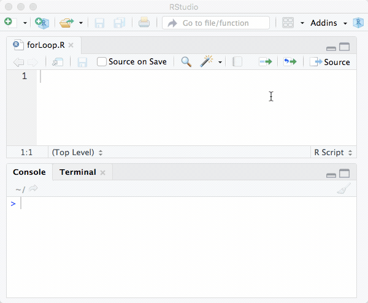
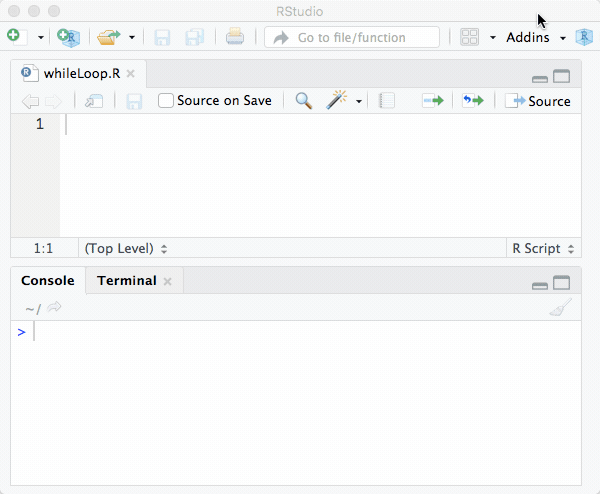
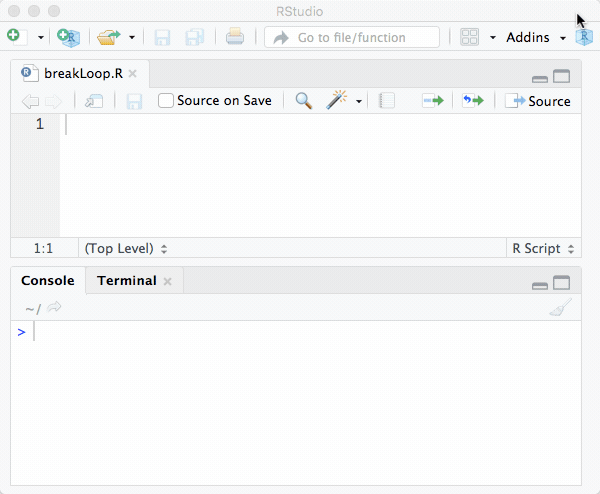
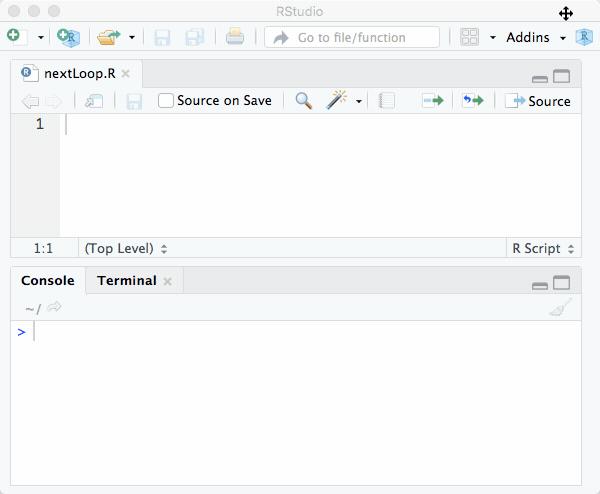

# Code Structure {#structure}

> "Begin at the beginning," the King, said gravely, "and go on till you come to the end; then stop."  
> -- Lewis Carroll, Alice in Wonderland


Like every other real programming language, R provides tools to structure your code based on conditional expressions meaning executing a part of the code dependent on a condition and loops to describe and perform similar tasks in a compact way. If you have no prior programming experience this may seem to be the hardest thing in the world, because you have to think of all the possible cases which occur in your situation to differentiate between them in your program. Additionally, you have to think in iterations, which means you have to find the common parts of your problems and put them into loops. But let us start at the beginning and look at conditional expressions.

## Conditional Expressions

### If and Else {-}
The most basic conditional expression is an `if`-statement. It is used to make expressions contingent on a certain condition and in R it has the following syntax.

```{r, eval=FALSE}
if ( condition ) {
  code  # Only executed if 'condition' is TRUE
}
```

```{r}
# A simple example
x <- 1
if (x > 0) {
  cat("Hello World!")
}
```

The condition is a set of commands that produce a single logical value namely `TRUE` or `FALSE` and the code in the body encapsulated by `{ }` is only executed if the condition is `TRUE`. If the first condition is not true it is possible to include an `else` statement which should be evaluated if the first condition cannot be fulfilled.


```{r, eval=FALSE}
if ( condition ) {
  code                    # Only executed if 'condition' is TRUE
} else {
  alternate code          # Evaluated if 'condition' is FALSE
}
```

There may be cases where two logical values are not enough to implement what you want. In this case, you can combine as many `if` clauses as you want with the statement `else if` and catch the rest of the cases (if none of your conditions is fulfilled) with a single `else` clause.

```{r}
x <- 314

if ( x < 10 ) {
  cat("X is a small number!")
} else if ( x > 100 ) {
  cat("X is a big number!")  
} else {
  cat("X is neither a big nor a small number!")  
}
```

When using logical operators it may be better to use double symbol notation `&&` rather than single symbol notation `&` (same with logical OR). The reason for this is because the double symbol notation evaluates the condition step by step from left to right and aborts and returns a value if a `FALSE` is found. This makes the execution of the code much more efficient, faster and so the way to go. However one should carefully check the evaluated expressions in order to avoid errors which can easily sneak in here.

There is a good reason that conditional expressions heavily rely on the usage of the word `else`. It seems that everything can be solved using `if`s only. While this is (sometimes) possible it is not advisable. Normally conditional expressions are mutually exclusive choices so that code can easily get confusing or erroneous. Let us consider the following example which would work perfectly fine and make much more sense with added `else`s.

```{r}
if ( x > 100 ){
  cat("X is a big number!")
}
if ( x > 10 ){
  cat("X is a moderate number!")
}
if ( x > 1 ){
  cat("X is a small number")
}
```

Another point to discuss is accuracy. When comparing objects in a setting such as the one discussed here, it is often better to use the functions `isTRUE()` or `!isTRUE()` rather than the combination of a logical operator and a logical value like `T ==` and `T !=` to evaluate a condition. This is due to the fact that conditional expressions, as well as conditional clauses, only work if there is a single (!!!) logical value provided, which can be enforced using functions that always return only a single value. One of the pitfalls are problems related to the precision of the calculations. Precision problems as the following one can also be solved using the function `all.equal()` which allows to set a `tolerance` argument and evens out the small precision problems in floating point calculations.

```{r}
num1 <- 0.2 - 0.1
num2 <- 0.3 - 0.2

num1 == num2

all.equal(num1 , num2 , tolerance=10^-5)
```

As speed is one of the most important things about programming and vectorized commands are pretty fast, there is also a vectorized `if/else` version in R.

```{r, eval=FALSE}
ifelse( condition , ifTRUE , ifFALSE)        # This is really fast!
```

```{r}
x <- 1:3
ifelse( x > 1 , x^2 , FALSE)
```


### Switch {-}
If you are using a lot of `if/else` constructs in your code this may get a little bit crowded and probably messy. R provides also a statement called `switch()` to return values contingent on a certain expression. This is also faster than combining lots of `if`-statements in your code but usually not as fast as the vectorized  `ifelse()`.

```{r, eval=FALSE}
switch( statement , case1 , case2 , ... )    # Basic syntax
```

```{r}
# Example if 'statement' is numeric
x <- 2
switch(x,"one","two","three")


# Example if 'statement' is a string
x <- "mean"
data <- c(1 , 5 , 7.5)
switch(x,"sd"=sd(data),"median"=median(data),"mean"=mean(data))
```

If the provided `statement` is a number then R returns the `case` with the matching index. If the `statement` is of type string, then R tries to match the statements and executes the code listed there. Using strings as a statement and formatting your code in a structured way you can receive the same appearance and feeling like you would with `switch-case`-statements in other programming languages.

The following code block shows alternative formatting (just some additional curly braces, spaces, and newlines) that create a look similar to other programming languages such as C or Java. However, one should be careful with switch as the behavior is not always totally intuitive as the following example shows.

```{r}
usertype <- "caseXX"
switch(usertype, 
       case1 = { 1 }, 
       case2 = , 
       case3 = {2.5},
       99)
```

This maps `case2` to the value defined in `case3` and additionally supplies and unnamed default value `99` for cases that are not defined or cannot be matched. If there is more than one match, the first matching element is used. For more information, try `?switch`. Despite being special in some cases `switch` is usually faster than a lot of `if` and `else` statements and keeps your code more organized.

## Loops
Loops are one of the most used and most important constructs while programming - they are somehow like the universal workhorse. Generally, a loop is a control structure which allows running specific lines of code over and over again until an exit condition is fulfilled or until a specified number of repetitions has been performed. While executing the same code several times the provided data can, of course, be alternated which makes loops very useful when performing a huge number of actions of the same type.

### For-Loop {-}

```{r, echo=FALSE, fig.cap=NULL, out.width="70%"}
if (knitr::is_html_output()){
  
}
```

A `for` loop runs specified code a fixed number of times. Therefore, you have to know in advance how often the code in the body of the loop should be executed. The `for` loop has the following general form. 

```{r,eval=FALSE}
for ( idx in vector){           # Basic syntax
  code
}
```

The typical iterator variable `i` that is commonly used in other programming languages should be avoided in R because it is already a reserved word for the imaginary unit when working with complex numbers. Common workarounds are using `it` (short for iterator), `ii` (just doubled to avoid using the reserved word) or `idx` (abbreviation for iteration index). 

```{r,eval=FALSE}
x <- 1:3
for ( idx in x) {
  print(idx)
}
```

### While-Loop {-}

```{r, echo=FALSE, fig.cap=NULL, out.width="70%"}
if (knitr::is_html_output()){
  
}
```

The `while` loop loops until the specified condition is false. It is often used when you do not know and can not calculate in advance how often the instructions will be executed. It has the following general form.


```{r,eval=FALSE}
while ( condition ){          # Basic syntax
  code
}
```

```{r,eval=FALSE}
idx <- 6
while ( idx < 10 ){
  print(idx)
  idx <- idx + 2
}
```

### Repeat {-}
The `repeat` loop is somehow similar to the while loop. The `while` loop starts a new run every time the condition is evaluated as `TRUE` while the `repeat` loop will always begin a new run and will only stop if it is told to do so with the `break` command. This means you can explicitly control which part of the loop should be executed and when the execution should be stopped.

```{r,eval=FALSE}
counter <- 0                  # Counter variable to count loops

repeat{                       # Repeat does not need a condition
  x <- rnorm(1)
  counter <- counter + 1
  if (x > 2) {
    print(counter)
    print(x)
    break 
  }
}
```


### Break and Next {-}

```{r, echo=FALSE, fig.cap=NULL, out.width="70%"}
if (knitr::is_html_output()){
  
}
```

We have already seen that `break` is able to abort the `repeat`-loop, but it is much more powerful and can break any of the discussed loops directly. Even if you can use `break` to abort loops on certain conditions this is a bad habit. It is always better to know when and how a loop should end and do this via the condition or by predefining the number of loops using the `for` loop.

```{r, echo=FALSE, fig.cap=NULL, out.width="70%"}
if (knitr::is_html_output()){
  
}
```

The `next` command is used to skip the following statements and if used in a loop it will increment the loop variable (`idx` in the `for` loop example). Here is a simple example to illustrate how both are working.

```{r,eval=FALSE}
for ( idx in 1:100) {
  x <- rnorm(1)
  if (x < 0) next
  print(x)
  if ( abs(x) > 3) break    # Break should normally be avoided
}
```


Generally one can say that loops in R are pretty slow and in most of the cases drastically slow down your code. Therefore, where possible *loops should be avoided*! In most of the cases it is much better (and faster!) to use vectorized functions like `apply()`, `sapply()` or `tapply()`.

### Special: Looping over non-numerical data {-}
R does not exactly support looping over non-numerical data, but it may be useful sometimes and of course, there are a few ways to accomplish this. The first one is using a function of R's mighty `apply()`-family. In this case `lapply()` is the way to go if the performed and desired loops are independent of each other and it is allowed to process them in any order.

Another option is using the function `get()`. In fact, the purpose is straight forward and sounds very simple. It takes a character string as an argument and returns the object of that name. Here is a short example of how to calculate the mean of three vectors.

```{r}
x <- rnorm(10)
y <- rnorm(1000)
z <- rnorm(1000000)

for ( idx in c("x","y","z")) {
  vec <- get(idx)
  print(mean(vec))
}
```


This simple example may give you an idea of how powerful the `get()`-function is. Try to imagine how flexible and powerful a routine written with the combination of `get()` and `paste()` can be. This does, however, not cover all possible cases, for example, if you want to loop over the elements of a list by name, the above example using `get()` won't work. 

```{r}
list <- list(x=x,
             y=y,
             z=z)

for ( idx in names(list)){
  print(list$idx)               
}
```


Of course there is a way to force R looping over the names and fetch the data. To achieve this you have to construct a string and then make R evaluate this string using the command `eval()`.

```{r}
for ( idx in names(list)){
  string <- paste("list$",idx,sep="")  # Constructing command
  data <- eval(parse(text=string))     # Evaluating command
  print(mean(data))                    # Working with fetched data
}
```


The shown example is, of course, arbitrary and the result could have been achieved easier using numeric values for `idx` and double brackets to address the i-th element in the `list`. Nevertheless, it shows Rs capabilities to loop over non-numeric content and gets really useful if you are dealing with more complex ways of addressing data. If you want to read R code from a file or are looking for another option to evaluate a concatenated string you can also use the `source()`-command.


## Exercises {-}
```{r, echo=FALSE, fig.cap=NULL, out.width="100%"}
knitr::include_graphics("gfx/CH00-ExercisesHeader.png")
```

### From April 26, 2022 {-}

```{r, echo=FALSE, fig.cap=NULL, out.width="100%"}
knitr::include_graphics("exercises/cswr_programming_R_exercises_code_structure.pdf")
```

<!--
### Clever BMI Calculator {-}

```{block2, type='rmdexercise'}
Expand your function `BMI()` in a way that it outputs an evaluation of the calculated BMI aside of the pure result. Make also sure that it outputs a useful warning if meaningless numbers are entered by a user.
  
```
-->

### 99 Bottles of Beer {-}

In early 1994, when the internet was only used by a fraction of the people that are using it today, someone posted the full lyrics of the song 99 Bottles of Beer to a humor mailing list, which was also heavily used by programmers. This was seen as an enormous waste of bandwidth because the lyrics could have been easily posted using six lines of BASIC code.

This small event was the occasion for Tim Robinson to develop and post his version of the song in C++ which inspired other programmers to post their version of the song which since then has been ported to nearly every programming language available and is one of the many classic yet funny stories from the early ages of the internet. The song has the following lyrics:

> 99 bottles of beer on the wall, 99 bottles of beer.  
> Take one down and pass it around, 98 bottles of beer on the wall.  
>   
> \[ \vdots \] 
>   
> 2 bottles of beer on the wall, 2 bottles of beer.  
> Take one down and pass it around, 1 bottle of beer on the wall.  
>   
> 1 bottle of beer on the wall, 1 bottle of beer.  
> Take one down and pass it around, no more bottles of beer on the wall.   
>   
> No more bottles of beer on the wall, no more bottles of beer.  
> Go to the store and buy some more, 99 bottles of beer on the wall.  
>  
> [END] 

```{block2, type='rmdexercise'}
Write a function called `bottlesong()` that outputs the famous and complete lyrics of the song 99 Bottles of Beer.
  
```

### Multiplication Table

```{block2, type='rmdexercise'}
Write a function `mulitplicationtable()` that outputs the multiplication table including results from $1 \cdot 1 = 1$ up to $10 \cdot 10 = 100$ to the console. The function should rely on loops, results should be calculated at runtine and the time delay between the output of two consecutive lines to the command line should be user-definable. 
  
```

The following block shows an abbreviated example output.

```{r, eval=FALSE}
1 x 1 = 1
1 x 2 = 2
1 x 3 = 3

...

10 x 9 = 90
10 x 10 = 100
```


### Diagonal Matrix
Write a function that creates a symmetric matrix with dimension $n x n$, that contains a value x on every element, except for the elements on the main diagonal which should contain value y. Wrap your code in a function `diagmat()` and make all mentioned values user-definable.

The following block contains an example output:

```{r,eval=F}

```
<!--

### Solution 1

```{r, eval=FALSE}
#' 99 bottles of beer song lyrics
#' Writes the complete "bottlesong" lyrics to the console.
#' @param b equals the number of bought bottles = bb
#' @param bb bought bottles with default = 99
#' @return Outputs text to the console, returns nothing explicitly.
bottlesong <- function(b = 99, bb = b){
  if (bb <= 1){
    cat("Come on, you have to buy at least two bottles of beer!!!")
  } else {
    while (b > 2){
      cat(b,"bottles of beer on the wall,",b,"bottles of beer. \n",
          "Take one down and pass it around,",b-1,"bottles of beer on the wall.\n\n")
      b <- (b-1)
      Sys.sleep(0.1)
    } 
    if (b == 2) {
      cat(b,"bottles of beer on the wall,",b,"bottles of beer.\n",
          "Take one down and pass it around,",b-1,"bottle of beer on the wall.\n\n")
    }
    cat(b-1,"bottle of beer on the wall,",b-1,"bottle of beer. \n",
        "Take one down and pass it around, no more bottles of beer on the wall.\n\n",
        "No more bottles of beer on the wall, no more bottles of beer. \n",
        "Go to the store and buy some more,",bb,"bottles of beer on the wall.")
  }
}


# Some Tests
bottlesong()          # Default
bottlesong(b=9)       # Only 9 bottles
bottlesong(bb=25)     # Rebuy 25 bottles
bottlesong(bb=1)      # Rebuy only 1 bottle
```


### Solution 2
```{r}
bottlesong<-function(nb=99){
  for(b in nb:0){
    b1 <- ifelse(b  >1,paste(b  ,"bottles"),ifelse(b  ==0,"No more bottles", paste(b  ,"bottle")))
    b2 <- ifelse(b-1>1,paste(b-1,"bottles"),ifelse(b-1==0,"No more bottles", paste(b-1,"bottle")))
    cat(b1, "of beer on the wall,", tolower(b1),"of beer.\n")
    if( b<1){
      cat("Go to the store and buy some more,", nb, "bottles of beer on the wall.")
    } else {
      cat("Take one down and pass it around,", tolower(b2), "of beer on the wall.\n\n")
    }
  }
}

#bottlesong()
```


### Solution 3
```{r}
bottlesong<-function(nbottles=99){
  x<-nbottles:3
  for(idx in x){
    cat(paste(idx, "bottles of beer on the wall,", idx, "bottles of beer.\n",
              "Take one down and pass it around,", idx-1, "bottles of beer on the wall.\n\n"))}
  cat(paste("2 bottles of beer on the wall, 2 bottles of beer. \n",
            "Take one down and pass it around, 1 bottle of beer on the wall.\n\n"))
  cat(paste("No more bottles of beer on the wall, no more bottles of beer.\n",
            "Go to the store and buy some more,", nbottles, "bottles of beer on the wall."))
}

#bottlesong()
```

-->


