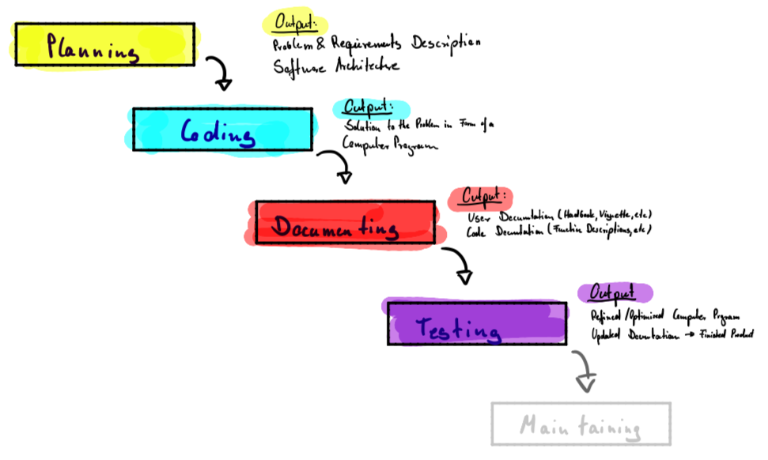
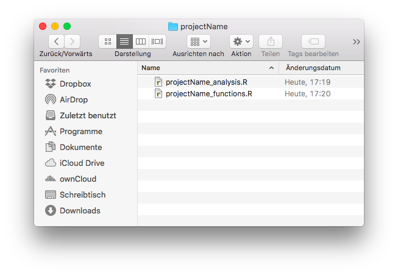
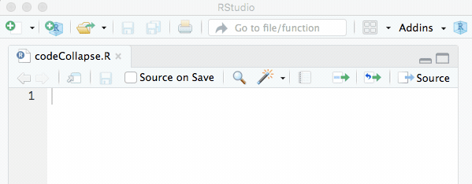
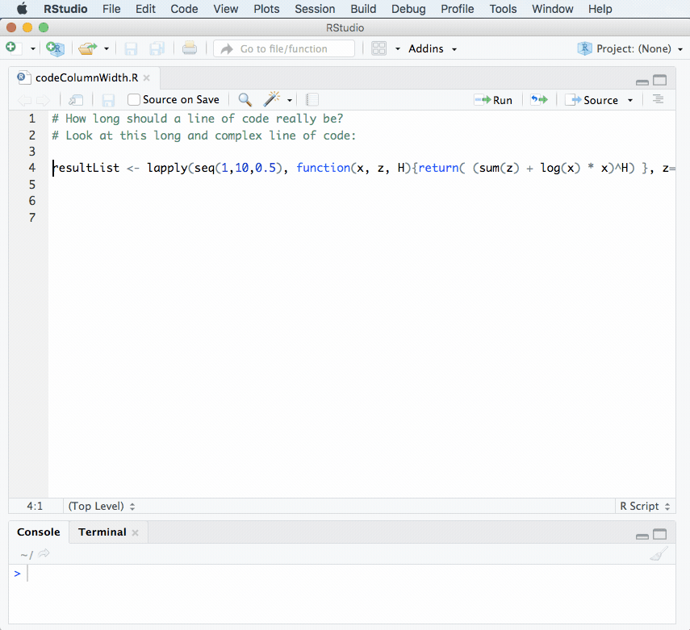

# Software Development

> First, solve the problem. Then, write the code.  
> -- John Johnson

Most programming projects start small and are not intended to grow. However, this is exactly what happens and after some time you are confronted with a large, complex and diffuse code base where nobody - including yourself - understands how the programs really work. Good coding style is like correct punctuation when using natural language. You can live without it, but it makes things a lot easier to understand and better to read. The reasons to advocate a good programming style are manifold:

- **Errors:** Good programming style helps to avoid errors, saves time when searching and correcting mistakes and reduces embarrassment that normally occurs if errors cannot be found.

- **Collaboration:** It occasionally occurs that problems are solved in teams rather than alone, a good programming style eases the handover and reduces introduction efforts when joining projects. It may also happen that someone (researcher, colleague) has to maintain or use your program. Good programming style eases the process of understanding dramatically.

- **Publications:** Supervisors for thesis or seminar papers as well as scientific journals usually want to know (implementations details) about data and estimation procedures to support transparency and reproducibility of scientific work. From an academic point of view, the quality of the provided code is often considered when grading assignments, theses or homework.

- **Memories:** Humans usually overestimate how much they remember and usually underestimate the necessity for future changes. Months after finishing or suspending a project, most people have forgotten the details and difficulties as well as dependencies when modifying the code. Your future 'you' will have the same problems as any colleague that has to use your code if you haven't looked at it for a couple of months.

Developing software is an intensive field of research, it has a lot in common with organization and project management, but usually is a lot more formalized. Many of the more popular Software Development Frameworks (SDF), like Rapid Application Development (RAD), Scrum, Extreme Programming (XP) or the Agile Unified Process (AUP) achieved attention and are actively adopted by other industries. 

All these frameworks, processes or however you want to refer to them have one thing in common and this is to ensure that a high-quality output (usually in terms of software) is being produced by one or more developers. While modern (agile) SDFs are usually used to manage teams and do not have distinct phases, more traditional approaches emphasize the idea of software development life cycle, where phases like planning, coding, documenting or testing occur sequentially rather than simultaneously. One of these process models is the software development waterfall, which clarifies the essential steps when writing software.

```{r, echo=FALSE, fig.cap="Waterfall Software Development Process", out.width="100%"}

```

The basic idea of the process is to divide the whole development project into sequential phases, where overlap and 'splashbacks' are tried to be avoided. As in traditional project management, the emphasis is on planning time schedules, target dates, and budgets, while the implementation of an entire system is done at once. The transition to the next phase usually requires the approval of a customer or user and written project documentation is an explicit deliverable of each phase.

The sequential nature and the resulting "inflexibility" in a pure waterfall model have been a source of constant criticism. In practice, the waterfall model has been superseded by more flexible and dynamic approaches and when working in teams a more agile SDF, e.g. Scrum, should be chosen as these eradicate many pitfalls found in the waterfall SDF. However, all of the following stages are always present and must be considered when developing software, regardless of the specific management approach.

## Planning
Especially in scientific environments software usually fulfills a strict purpose and solves an (academic) problem. The planning phase, therefore, captures the user requirements and aligns them with the prospective software architecture. The output of this phase usually is a document with the requirements and a plan for the software architecture.

<!--
Explanation requirement document
Explaation software architecture
+ Examples
-->

For good software, it is key to separate the actual coding from the planning phase. Usually, it is a good idea to **start a new project with an empty sheet of paper** and collect the theoretical and practical aspects to form a sketch of the possible solution. Do not think about technical details in this phase too much, but write down your ideas in `pseudo code` like *load data*, *transform (scale and logarithmize) input*, *calculate regression coefficients*, * analyze error terms*.

Sub-problems that occur multiple times or code that needs to be executed more than once should be **modularized** and needs to be put into a function. This avoids inconsistencies and provides a single place to maintain functionalities and implement changes. Besides this, functions have additional advantages - they make the code more readable and facilitate testing and validation. When wrapping boring sections like data transformation in a function this can usually be done by a single line of code including easily visible arguments. Therefore, you can think of modules like building blocks to your solution, each block (function) should handle a single task and not more. In addition to solving one thing well, functions should be flexible and solve a **sufficiently general** problem. It is more advisable to make a function flexible and solve the n-dimensional case (and avoid hard-coding the 2-dimensional case), as your requirements may increase over time.

The general steps and the building blocks of functions can be combined into an architecture that solves the specific problem. Proceeding this way, the problem is being divided into simpler steps and each sub-problem is solved individually (Principle: Divide and Conquer). It is always advisable to support the planning process with a **graphical representation** that allows to easily discover dependencies and the right sequence of commands. While computer and system sciences lead to a huge variety of "modeling languages" even simple graphical representations are often useful. 

<!--
The most basic diagrams to visually express code are Nassi-Schneiderman Diagrams, while processes and other sequences can easily be visualized using the Unified Modelling Language (UML). 

Workflow: no data manipulation in spreadsheet programs
-->

A lot of problems and requirements have already been solved and implemented by other programmers and quite often there is no need to reimplement every little step on your own. It is fair and good practice to reuse, modify and recycle existing packages, libraries, functions or code fragments. "Whenever possible, steal code" is one of the many bits of advice frequently given to new programmers. While this is usually good advice and shortens the implementation and coding requirements it still comes at the cost of understanding and integrating someone else's code into your project. While code often can be freely found in the web, it still comes with some requirements and liabilities which are usually bundled in the respective license that is linked or distributed with the code. Regardless of the license under which the software is distributed the usage of someone else's ideas or intellectual property - especially in scientific projects - needs to be cited. If you use R packages they conveniently provide a reference that can be cited and is accessible with the command `citation("packagename")`. If `citation()` is used without an argument it returns the reference for the R Base System.

```{r}
citation()
```

Integrating other functions, packages or code fragments means to organize and handle how different functions hand over data, which means one has to **think about the data format** and use **standard data formats** wherever possible. Choosing or creating a data format is not to be mistaken by choosing a file extension like `.txt`,`.csv` or `.ppt` but defines the structure of your `list`, `data.frame` or comparable data-structure present in R. Choosing a standard, therefore, refers to choosing the type of object that captures, organizes and stores data, estimation results or other output. This is important for several reasons as bad designs of the data structures make the coding more difficult and the program less readable. Often one needs to consider that empirically derived results are almost never perfect or satisfactory after a first run and need to be recalculated on different subsets or transformations of the data. A designed data structure needs to combine all results including the envelope and meta information, like function arguments, etc. Last but not least a clever and compact design of the resulting data structure can affect the actual execution speed of a program significantly. 

Choosing a standard or convention is especially important. Imagine when using a matrix to store individual observations for e.g. multiple time series it makes sense to store the observations in rows and the variables/time series in columns. Additionally, one needs to think about missing values in the data (e.g. calendarial effects like holidays) and how to handle them.

<!--
within R:
ts
zoo
mts

Some data exchange standards:
JSON
-->

## Coding

Writing code that a computer can understand is actually quite easy - we have even written a simple function in the very first unit of this course. Good code, however, is written for humans to read and only incidentally for machines to execute. It, therefore, is good practice to write code with a reader in your mind (e.g. your supervisor for a thesis, a colleague or your grandparents).

Most of the problems tackled in scientific projects can as well be solved with simple solutions. Advanced logic and aiming for short solutions (e.g. one-liner) may make code hard to read and even harder to understand. The objectives to head for when writing software are therefore clarity and brevity. Speed is important, but there is no necessity to tweak out every little bit of performance (in terms of speed and memory) and this should only be the chosen path if it is really necessary. To ensure readability you should adopt standard code layouts. 

While normal analyses and simple programming exercises usually can be pretty well organized with a few R files (.R), bigger projects normally rely on more advanced structures such as R Project files (.Rproj) and Packages. Being an introductory course we focus on simple organization schemes and refer to the appendix (for a very short introduction) and the literature. 

```{r, echo=FALSE, fig.cap="Exemplary simple Project Skeleton", out.width="70%"}

```

Apart from simple analyses, most projects require some software development and own functions that are used to analyze a respective dataset. Custom functions should be separated from the pure analysis if they reach a critical mass (which is usually the case), so that it is good advice to separate the code base into two files, like in the figure above. The following chapters discuss the layout of these files before introducing and discussing some additional principles and things to consider when filling the files with actual code. 

### Standard Program Structure
The standard program structure contains the actual analysis (contrary to own functions) and should contain the following elements:

1. **Headline:** The Name of the Program
2. **Preamble:** A short text explaining the purpose and basic principles of the program, what it does and how it is intended to be used; including a license statement if necessary.
3. **Author:** Name and contact information of the author(s), the (release) date and the version of the software. If multiple versions exist, the version information in the form of a changelog can be handed out.
4. **Program:** The actual program divided into parts or blocks.
    a) **Dependencies:** Here external dependencies like libraries or a custom function file should be loaded. If the function file would only contain a few short function definitions it makes obviously no sense to create an own file for them. *As long as the readability* of the function file is *not affected* the function definitions could also be included here.
    b) **Constants:** Constant values that your program relies on and values that parameterize the methods used below should be user changeable, bundled and included in the second block, directly after loading external dependencies.
    c) **Problem Solving:** Here the actual problem solving takes place. Of course, this part can be divided into multiple parts or blocks. 
    d) **Output:** The output generated by your analysis usually plots, tables or PDFs should be created and exported in the last block of the program. 

```{r, eval=F}
# Example of Standard Program Structure 
 
# This is an example skeleton of a Standard Program Structure that can be used
# to structure own programs and analyses. It was written purely for educational
# purposes and is part of the lecture notes for the course 'Computational
# Statistics using R'.

# Author: Benjamin Buchwitz (benjamin.buchwitz@ku.de)
# Date: 01.01.1970
# Version Changelog: 
#   v0.1 - Initial Release
#   v0.2 - Major Improvements in Speed and Stability

################################################################################
## PART I: Load Libraries and external Dependencies
################################################################################

# Loading installed packages -------
library(ggplot2)
library(forecast)

# Loading own functions ------------
setwd("~/projectName")                # Set working directory to project folder
source("projectName_functions.R") 

################################################################################
## PART II: Define Constants
################################################################################

a <- 0.5            # Initial calibration Parameter
n <- 100            # Length of simulated Data
T.eff <- 80         # Value used in the Model

x <- rnorm(n)       # Data; standard normally distributed
y <- rnorm(n) + 5   # Data; mean shifted to 5

################################################################################
## PART III: Problem Solving
################################################################################

res <- CalculateSampleCovariance(x, y, verbose=FALSE)

...

################################################################################
## PART IV: Output Results
################################################################################

# Save estimation results ----------
saveRDS(res, "projectName_results.rds")

# Create publication ready plots ---
pdf("plotexample.pdf")
plot(x, y, main="An awesome Plot")
dev.off()

```

### Standard Function Structure
The second file contains the functions and should have the following structure.

1. **Headline:** The Name of the Program that the functions belong to
2. **Preamble:** A short text explaining the purpose and basic principles of the functions, what they do and how they are intended to be used; including a license statement if necessary. This can be the same text as in the file described above.
3. **Function Definitions:** Actual definitions of the functions. Each function definition should retain the following structure:
    a) **First Line:** Function Constructor and Name of the function
    b) **Preamble:** The preamble of a function fulfills similar purposes as the preamble of the file that contains the analysis or function itself. It contains a headline that very briefly describes what the functions do. If necessary an additional text describes the function and its extended purposes or way of implementation. After that *all* Arguments of the function are introduced and described. Finally, the output, including the corresponding data structure is described.
    c) **Body:** The Code that actually solves the Problem.

```{r, eval=F}
# Example file with Standard Function Structure

# This is an example skeleton that contains a Standard Function Structure. The
# functions defined here are needed to for the Standard Program Structure above.
# It was written purely for educational purposes and is part of the lecture 
# notes for the course 'Computational Statistics using R'.

# Author: Benjamin Buchwitz (benjamin.buchwitz@ku.de)
# Date: 01.01.1970
# Version Changelog: 
#   v0.1 - Initial Release
#   v0.2 - Major Improvements in Speed and Stability

################################################################################
## Function Definitions
################################################################################

#' Computes the sample covariance between two vectors.
#'
#' This function calculates the ordinary sample covariance between two vectors,
#' it is intended to be either used by a user directly and is also used in
#' some other functions, e.g. when calculating the correlation coefficient.
#'
#' @param x One of two vectors whose sample covariance is to be calculated.
#' @param y: The other vector. x and y must have the same length, greater than 
#'           one, with no missing values.
#' @param verbose Logical. If TRUE, prints sample covariance; if not, output 
#'          is suppressed. Default is TRUE.
#'           
#' @return The sample covariance between x and y.
CalculateSampleCovariance <- function(x, y, verbose = TRUE) {
  n <- length(x)
  # Error handling
  if (n <= 1 || n != length(y)) {
    stop("Arguments x and y have different lengths: ",
         length(x), " and ", length(y), ".")
  }
  if (TRUE %in% is.na(x) || TRUE %in% is.na(y)) {
    stop(" Arguments x and y must not have missing values.")
  }
  covariance <- var(x, y)
  if (verbose)
    cat("Covariance = ", round(covariance, 4), ".\n", sep = "")
  return(covariance)
}

...

```

### Naming Convention
While the aforementioned Standard Program Structure and the Standard Function Structure regulate what should be presented when developing code it is still unclear how functions, arguments, objects, classes or files should be named. Naming things is considered one of the more tricky parts in computer science. As it may be complicated to change e.g. a function name after it has been heavily used in other functions one needs to adopt a clear and vivid naming scheme. This also ensures that named functions, classes, etc. speak for themselves and is essential to produce readable and self-explaining code. 

The following list shows some popular naming conventions that all more or less frequently occur in several programming languages. Of course, not all developers that produce and distribute R software follow the same naming conventions. The function names given in the list below are R functions to illustrate how and where the respective naming scheme can be found within R. The shown list including some additional discussion can be found in the [R Journal](https://journal.r-project.org/archive/2012-2/RJournal_2012-2_Baaaath.pdf).

- `alllowercase`: All letters are lower case and no separator is used in names consisting of multiple words as in `searchpaths` or `srcfilecopy`. This naming convention is common in MATLAB. Note that a single lowercase name, such as `mean`, conforms to all conventions but UpperCamelCase.
- `period.separated`: All letters are lower case and multiple words are separated by a period. This naming convention is unique to R and used in many core functions such as `as.numeric` or `read.table`.
- `underscore_separated`: All letters are lower case and multiple words are separated by an underscore as in `seq_along` or `package_version`. This naming convention is used for function and variable names in many languages including C++, Perl, and Ruby.
- `lowerCamelCase`: Single word names consist of lower case letters and in names consisting of more than one word all, except the first word, are capitalized as in `colMeans` or `suppressPackageStartupMessage`. This naming convention is used, for example, for method names in Java and JavaScript.
- `UpperCamelCase`: All words are capitalized both when the name consists of a single word, as in `Vectorize`, or multiple words, as in `NextMethod`. This naming convention is used for class names in many languages including Java, Python, and JavaScript.

When working in professional software development teams or joining existing projects one usually has to adapt to the defined naming convention. However, when developing alone one should still follow some rules. A good set of rules to follow are these ones:

```{block2, type='rmdtip'}
**A Personal Naming Convention**

1. This naming convention applies to variables, functions, and R files. Files that contain R code are always saved with the extension `.R`.
2. All names are self-explaining English words, usually not abbreviated and at least 3 letters long. I use the singular even if numerous entries are expected. Example: price, duration, strike.
3. Names for objects and functions use the `lowerCamelCase` naming scheme with the modifications listed below.
4. Exceptions to (1) and (2) are widely used single-letter symbols and widely used acronyms. For both, I use only uppercase letters. Examples: X, Y in regression analysis or FFT, GDP.
5. Uppercase letters concatenate words. The following rules apply to
concatenated names:
– Names of variables start with the most general term and end with the most specific (the latter usually denoting a certain method). Examples: optionPriceFFT, optionPriceAnalytic, optionStrike.
– Names of functions start with the name of the project, followed by the object of the function, what it does and finally the specific method. Examples: wishartOptionPricingFFT, wishartOptionPricingCosfft, wishartOptionPlotting.
6. To avoid confusion, I use the prefix "my". This may be necessary if one variable is used locally to calculate a variant of a model or if the name conflicts with an existing R command. Example: myLinearModel, myDate.
7. **Use common Sense and be CONSISTENT!** When you reach a point, where the naming convention fails do not use it in this special case and check if it needs to be adapted and improved. 

*Recommendations following: Gruber (2013) - Solving Economics and Finance Problems with MATLAB.*
  
```

### Rules & Best Practices
The following presents some rules and best practices that are widely adopted by programmers and have been proven useful:

- Comment your code. Each line of a comment should begin with the comment symbol `#` and a single space. Comments should explain the why, not the what. Check twice if the comment is clear and if it is really needed.

- Rely on commented lines of `######`, `#====` or `#----`  to break up your file into easily readable chunks. While writing your code you can collapse these sections in RStudio so that you do not have to scroll over them every time.

```{r, echo=FALSE, fig.cap=NULL, out.width="70%"}
if (knitr::is_html_output()){
  
}
```

- If you want to implement a feature later or if you assign the responsibility to implement something to a team member choose a consistent style for TODOs throughout your code. 

```{r, eval=FALSE}
# TODO(username): Explicit description of action to be taken.
```

- Use White Space and indentation to structure your code, but avoid the tabular key (RStudio helps you by translating every tab into 2 spaces automatically).

- Aim for a code width of 80 characters or less, so that your code can be printed if necessary and stays fully visible in text editor windows with moderate width (avoid the necessity to scroll vertically). RStudio provides support for this by displaying a thin grey line in the code editor, that can be enabled via the menu under Tools -> Global Options Dialogue. Choose the Code pane and select the Display tab to checkmark the "show margin column" option.

```{r, echo=FALSE, fig.cap=NULL, out.width="70%"}
if (knitr::is_html_output()){
  
}
```

It is pretty easy to find a case for which we have not discussed a rule yet. Due to the sheer complexity of the topic, we, therefore, rely on some popular examples to follow. Many professional developers have spent and effort to conceptualize complete style-guidelines, some with complete naming schemes and some without one. The following links will point to the most common style guides for R and you are encouraged to choose one (in addition to the things already discussed) when developing software. Note that none of these style guides is an official R standard and that there is (and possibly never will be) no such thing.

- [The Tidyverse Style Guide](http://style.tidyverse.org/)
- [Google’s R style guide](https://google.github.io/styleguide/Rguide.xml)
- [Hadley Wickham’s Style Guide](http://stat405.had.co.nz/r-style.html)
- [Bioconductor’s Coding Standards](https://bioconductor.org/developers/how-to/coding-style/)
- [Colin Gillespie’s R Style Guide](http://csgillespie.wordpress.com/2010/11/23/r-style-guide/)

## Documenting
Software that is intended to be used needs to be documented. During the coding chapter, we actually covered a few important steps that already contain documentation of a program. Generally, the provided documentation for a program can be divided into code documentation and user documentation. Examples for the code documentation are the comments that explain the implemented steps directly in the code, while the user documentation usually consists of long term documentation such as a vignette or accompanying book to explain what the developed software does. 

### Code Documentation (Short-form Documentation)
Code documentation is sometimes also referred to as short-form documentation. As mentioned previously it supports readers of your code, mainly while using the code. It is intended to briefly explain arguments to functions and basic working principles. R in combination with various packages support you by documenting your code. The documentation style using the modified comment `#'` is implemented by the package `roxygen2`. It allows creating a help page directly from the function preamble, that is later accessible via the R help system `?`. 

This is useful and saves a lot of work as this part of the documentation can be written at the same moment as the software itself. However, to be available via the `?` operator, it is required that your code will be delivered to users as an R package. While we have not covered that yet, it is still beneficial to form a habit of documenting your code this way. The following table provides a short overview of some tags that you can (and should) use when documenting your code. 

| Tag                 | Explanation                                      | 
|:--------------------|:-------------------------------------------------|
| `@param`            |  Describe function parameter                     | 
| `@return`           |  Indicate what the function returns              | 
| `@examples`         |  Possible usage example of the function          | 
| `@seealso`          |  Function that may be relevant to understand     | 
| `@author`           |  Author of the respective function               | 
| `@keywords`         |  Contextual topic of the function                | 
| `@references`       |  Web or academic reference to the function       | 
 
However, the `roxygen2` package is not limited to these tags but provides excessive options that are especially useful when developing R packages. A brief overview of capabilities and options for the roxygen engine is available in a [Cheat Sheet](https://www.rstudio.com/wp-content/uploads/2015/03/devtools-cheatsheet.pdf).


### User documentation (Long-form Documentation)

Long-form documentation describes the program, which can consist of a single or multiple functions, in more detail. It provides insights on what the program does and is the right place to elaborate on implementation details or explain the statistical or mathematical theory behind your routine. Long form documentation is usually called a *vignette* and can be anything from a short technical note over a journal article to a complete book. It can, therefore, serve as user documentation, allowing and explaining possible customization options and describe everything in more detail than the accompanying code documentation. Available documentation for an installed package can be viewed using the function `vignette()`.

```{r, eval=FALSE}
vignette(package="forecast")
```

```{r, highlight=FALSE, eval=FALSE}
Vignettes in package ‘forecast’:

JSS2008            Automatic Time Series Forecasting: the forecast Package for R
                   (Hyndman & Khandakar, JSS 2008) (source, pdf)
```

For example, the vignette for the forecast package is a journal article that was published in the Journal of Statistical Software (JSS). It will be downloaded when installing the package or, as the JSS is an open access journal, is also available to be downloaded [here](https://www.jstatsoft.org/article/view/v027i03).

A good way to write long-form documentation is using RMarkdown, which is a specialized version of Markdown - a plain text formatting system. R Markdown hast multiple advantages: it is strictly focussed on content, can intermingle text and results from code executions and is tightly integrated into RStudio. It is, therefore, the optimal solution for documenting programming challenges, solving assignments or writing theses that rely on R. The syntax employed by Markdown is simple and straightforward and it allows you to produce many kinds of output such as HTML, pdf or even Microsoft Word documents.

## Testing
Software testing is an investigation conducted to provide stakeholders with information about the quality of the tested code. Its goal is to generate an independent view of the software that allows understanding of how the developed product can affect its (business) environment. In professional environments, this allows finding bugs and verifies that the software product is fit for production purposes.

Software testing involves the execution of a software component (e.g. a small function) or system component (e.g. a large function or a whole package) and evaluates at least one property of interest. This can, for example, be the requirements that have been noted when planning the program. Testing usually checks the behavior of the software under all kinds of inputs, evaluates the response time and efficiency and simulates conditions in practical uses.

As the number of possible tests is almost infinite, professional developers employ test strategies that intend to find errors, unexpected results or general misbehavior. As all discussed steps in this chapter, testing is an iterative process. Fixing one error can lead to previously hidden deeper bugs or can even create new ones. As this is not a course on software engineering, we limit our testing framework to the following rules of thumb that can serve as a guideline after writing our first programs.

- Test in an organized and modular way, ideally by making a plan.
- Check every function separately.
- Test every scenario at least twice, especially when you have modified your function or fixed an error.
- Find and test boundary values.
- Test for different and deliberately false input.
- Do not only look for errors, often warnings reveal much more subtle problems, that need to be resolved.
- Document what you test.

A more comprehensive way of testing in an automated fashion is provided by the `testthat` package, which is the most popular unit testing solution in R. However, as this is an introductory course we do not cover automated testing in more detail.

## Maintaining
Software systems evolve and need adaptation as well as fixes to continuously deliver results for their users. Maintenance allows preserving the value that the software provides over time. Generally, maintenance is any change to the software after it has been used for production purposes for the first time. 

The key software maintenance issues are both managerial and technical ones. Usually, maintenance tasks include error fixing, capabilities extensions, removing obsolete capabilities, and process or functionality optimizations. Productive software requires strict versioning to allow users as well as developers to keep track of the changes. While simple programs that are being written for simple analyses or software that implements research prototypes often only require a single "release", this is obviously different for business and professional applications. Naturally, maintenance in a research context is not that intensively discussed, and as this is an introductory course we abstain from further explanations here. However, maintaining the value a software delivers has to be kept in mind for bigger and continuous projects.


## Exercises {-}
```{r, echo=FALSE, fig.cap=NULL, out.width="100%"}
knitr::include_graphics("gfx/CH00-ExercisesHeader.png")
```


### From May 3, 2022 {-}

```{r, echo=FALSE, fig.cap=NULL, out.width="100%"}
knitr::include_graphics("exercises/cswr_programming_R_exercises_software_development.pdf")
```


| Description | R script | 
| :---: | :--------:   | 
| main program | [main_program_aus_tourism](exercises/aus_tourism/main_program_aus_tourism.R)    |
| function `selectedData()` | [selectedData](exercises/aus_tourism/selectedData.R) |
| function `plotTs()` | [plotTs](exercises/aus_tourism/plotTs.R) |
| function `summarizeRegion()`   |  [summarizeRegion](exercises/aus_tourism/summarizeRegion.R) |

<!-- 
## Software Engineering
## Licensing

## exercises {-}
```{r, echo=FALSE, fig.cap=NULL, out.width="100%"}
knitr::include_graphics("gfx/CH00-exercisesHeader.png")
```

-->
