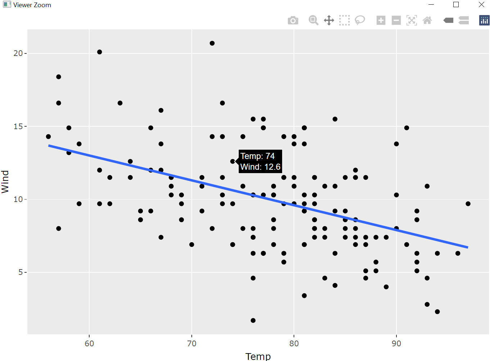
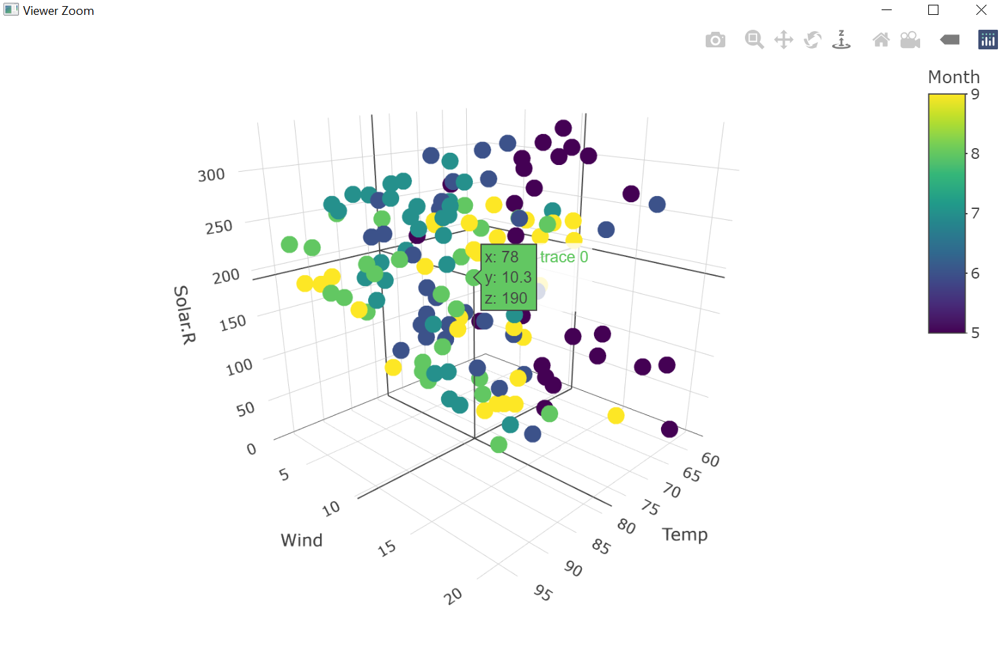

# Applications - Graphics 

```{r, echo=FALSE, fig.cap=NULL, out.width="100%"}
knitr::include_graphics("exercises/applications_graphics/cswr_programming_R_appl_graphics.pdf")
```

## Plots with base R{#plotsbaseR}

base-R provides already a lot of functions to create plots; we want to take a look at them in this subsection. Since we cannot go into detail concerning all parameters and arguments the functions provide, just check them out by calling the corresponding help pages (e.g. `?plot`).

### `plot()`

`plot()` allows building two-dimensional plots by simply defining two vectors `x` and `y` as follows

```{r dens-norm, fig.cap="Density function of a normal distribution."}
x <- seq(from = -8, to = 8, by = 0.1)
y <- dnorm(x = x) # density function of the normal distribution with mean = 0 and 
# standard deviation = 1, by default
plot(x = x, y = y)
```

Alternatively, `plot()` can also handle a formula as data input like `y ~ x`. Consequently, 

```{r, eval=FALSE}
plot(y ~ x)
```

results in the same plot as in figure \@ref(fig:dens-norm).\newline
By defining the arguments `main`, `xlab` and `ylab` in `plot()`, a title for the plot, for the x and y axis can be added, respectively. Instead of plotting points, a line that goes through the points can be drawn by defining `type = "l"`. Furthermore, both - points and a line - are visualized by calling `type = "b"` (**b** stands for **b**oth); further options are possible.

To the plot above, figure \@ref(fig:dens-norm), further lines can be added by calling `lines()` for example:

```{r dens-norm-lines, fig.cap="Density functions for the normal distribution with means 0, -1 and 2."}
y2 <- dnorm(x = x, mean = -1)
y3 <- dnorm(x = x, mean = 2)
plot(x, y, main = "Normal distribution - density", type = "l")
lines(x, y2, col = "cyan")
lines(x, y3, col = "blue")
```

where we have also defined colors for the single lines via the argument `col`.
To visualize horizontal and/or vertical lines in the plot the x and y coordinates - where the lines start and end - are necessary. Adding these two lines 

```{r, eval=FALSE}
lines(x = c(0, 0), y = c(0, 0.4), col = "grey") # vertical line starts in (0, 0) and ends in (0, 0.4)
lines(x = c(-8, 8), y = c(0.2, 0.2), col = "darkgreen") # horizontal line starts in (-8, 0.2) and ends in (8, 0.2)
```

to figure \@ref(fig:dens-norm-lines) results in:

```{r dens-norm-lines2, fig.cap="Plot of three density functions for the normal distribution with means 0, -1 and 2, respectively, and a horizontal and a vertical line."}
y2 <- dnorm(x = x, mean = -1)
y3 <- dnorm(x = x, mean = 2)
plot(x, y, main = "Normal distribution - density", type = "l")
lines(x, y2, col = "cyan")
lines(x, y3, col = "blue")
lines(x = c(0, 0), y = c(0, 0.4), col = "grey") 
lines(x = c(-8, 8), y = c(0.2, 0.2), col = "darkgreen")
```


Analogously, (further) *points* can be added to a plot by `points()` and *text* by `text()`, e.g. adding

```{r, eval=FALSE}
points(x = x, y = dnorm(x = x, mean = 0, sd = 0.5), pch = 19, col = "darkblue")
```

to figure \@ref(fig:dens-norm-lines2) results in figure \@ref(fig:dens-norm-lines3):

```{r dens-norm-lines3, fig.cap="Plot of four density functions for the normal distribution.", echo=FALSE}
y2 <- dnorm(x = x, mean = -1)
y3 <- dnorm(x = x, mean = 2)
plot(x, y, main = "Normal distribution - density", type = "l")
lines(x, y2, col = "cyan")
lines(x, y3, col = "blue")
lines(x = c(0, 0), y = c(0, 0.4), col = "grey") 
lines(x = c(-8, 8), y = c(0.2, 0.2), col = "darkgreen")
points(x = x, y = dnorm(x = x, mean = 0, sd = 1.5), pch = 19, col = "darkblue")
points(x = x, y = dnorm(x = x, mean = 0, sd = 2), pch = 21, col = "khaki")
```


Several arguments exist to customize points (and text); e.g. `pch = 19` creates filled points. See `?points` and `?text` for much information.
A list of colors that can be assigned to the argument `col` is given by @Wei2021 (\url{http://www.stat.columbia.edu/~tzheng/files/Rcolor.pdf}). Instead of writing the names of the colors as @Wei2021 introduces, the hexadecimal code can also be used.


After plotting the density functions in figure \@ref(fig:dens-norm-lines), it is of interest to add a legend to the plot which can be done with `legend()`:

```{r dens-norm-lines-legend, fig.cap="Density functions for the normal distribution whose properties are annotated by the legend."}
plot(x, y, main="Normal distribution - density", type="l")
lines(x, y2, col="cyan")
lines(x, y3, col="blue")
legend(x = "topleft", legend=c("mean = 0, sd = 1", "mean = -1, sd = 1", "mean = 2, sd = 1"),
text.col=c("black", "cyan", "blue"))
```

where the first argument can be a pre-defined keyword (here: `"topleft"`) or coordinates where to position the legend. The content of the legend, i.e. descriptions of the plotted data (here the distribution functions), is presented by the argument `legend`. Here, information about the mean and standard deviation of each density function is shown in the legend.\newline
There are much more arguments of `legend()` to define, e.g.:

+ `text.col`: the color of the legend text,

+ `text.font`: the font of the legend text,

+ `pch`: plotting symbols,

+ ...


The legend in figure \@ref(fig:dens-norm-lines-legend) is bad concerning mathematical notations. Therefore, the R package `latex2exp` by @latex2exp allows integrating LaTeX into R by calling `TeX()` and using the known LaTeX-notation (`$...$`) like:

```{r, dens-norm-lines-legend2, fig.cap="(ref:dens-leg2)"}
plot(x, y, main="Normal distribution - density", type="l")
lines(x, y2, col="cyan")
lines(x, y3, col="blue")
legend("topleft", legend=c(latex2exp::TeX("$\\mu=0, \\sigma=1$"),
latex2exp::TeX("$\\mu=-1, \\sigma=1$"), latex2exp::TeX("$\\mu=2, \\sigma=1$")), 
text.col=c("black", "cyan", "blue"))
```

(ref:dens-leg2) Density functions for the normal distribution whose properties are annotated by the legend based on `latex2exp` [@latex2exp].

### Histograms and boxplots

Histograms and boxplots are helpful devices to get a closer look at the values of some variables. In the following we will focus on the `airquality` data set which consists of six variables in order to describe the daily air quality in New York (May to September 1973) from the R package `datasets` [@R]:

```{r}
head(airquality)
```

A Histogram for example of the variable `Temp` (Temperature in °F) [@R] can be created based on `hist()` like this (we already know the arguments `xlab`, `ylab` and `main` from `plot()`):

```{r}
h_temp <- hist(x = airquality$Temp, xlab = "Temperature [°F]", ylab = "Count",
               main = "Histogram - Temperature")
```

Usually, when a plot is assigned to a variable (here we assigned the histogram of `Temp` to `h_temp`), the plot will not be shown, but this is not the case here. The argument `plot` of `hist()` is set to `TRUE` by default (see `?hist`).\newline
The benefit of assigning the histogram to a variable (here: `h_temp`) is that we can access information about the plot, i.e. histogram:

```{r}
h_temp
```

From that we see the following:

- `breaks`: the bin boundaries,

- `counts`: the counts in (a,b],

- `density`: relative frequencies divided by binwidth,
here: density = `h_temp$counts / sum(h_temp$counts))/5`,

- `mids`: midpoints of the bins,

- `equidist`: whether distances between breaks are the same and

- the class of `h_temp` which is a "histogram" (see also `?hist`).

If it is desired to compare histograms with each other, it will be helpful to plot them on top of each other or side by side. In our example, we plot the histogram of `Temp` and of `Wind` on top of each other by defining `par(mfrow = c(2, 1))` (the first values indicates the number of rows (here: `2`) and the second value indicates the number of columns (here: `1`)):

```{r hist-temp-wind, fig.cap="(ref:histogram-t-w)"}
par(mfrow = c(2, 1)) # c(r,c): c(number of rows, number of columns)
hist(x = airquality$Temp, xlab = "Temperature [°F]", ylab = "Count", 
     main = "Histogram - Temp.") # main  = "" to leave out the title
hist(airquality$Wind, xlab = "Wind [mph]", ylab = "Count",
     main = "Histogram - Wind")
```

(ref:histogram-t-w) Histograms of the temperature and the wind speed of the `airquality` dataset [@R].

In order to create boxplots in base-R the function `boxplot()` is available which works similarily like `hist()` (and `plot()`).

```{r box-temp-wind, fig.cap="(ref:box-t-w)"}
par(mfrow = c(1,2)) # c(r,c): c(number of rows, number of columns)
b1 <- boxplot(x = airquality$Temp, main = "Boxplot - Temperature [°F]")
b2 <- boxplot(x = airquality$Wind, main = "Boxplot - Wind [mph]")
```

(ref:box-t-w) Boxplots of the temperature and the wind speed of the `airquality` dataset [@R].

When we assign the boxplots of the temperature (`Temp`) and the wind speed (`Wind`) to `b1` and `b2`, respectively, we get information about the boxplots. Exemplarily, we look at `b2`:

```{r}
b2
```

with its return values:

+ `stats`: lower whisker, $q_{0.25}$, $q_{0.5}$, $q_{0.75}$ (25 %-, 50 % (Median)- and 75 %-Quantile) and upper whisker (the whiskers extend to maximal $1.5 \cdot \text{ interquantile range }$ by default),

+ `n`: number of non NA observations,

+ `conf`: lower and upper extremes of the notch,

+ `out`: any data point outside the whiskers,

+ `group`: indicating to which group the outliers belong and 

+ `names`: naming the groups (see `group`).

Based on the information saved in `b2` and the functions `points()` and `text()` *important* values are marked in our boxplot (figure \@ref(fig:box-wind)).

```{r box-wind, fig.cap="(ref:b-wind)"}
boxplot(x = airquality$Wind, main = "Boxplot - Wind [mph]", medcol = "chocolate")
points(x = rep(1,length(b2$out)), y = b2$out, col = "orange", pch = 19)
points(x = 1, y = min(airquality$Wind), col = "khaki3", pch = 17)
points(x = 1, y = max(airquality$Wind), col = "darkred", pch = 17)
text(x = 0.7, y = b2$stats[3,], labels = b2$stats[3,], col = "chocolate")
```

(ref:b-wind) Boxplot of the wind speed of the `airquality` dataset [@R].

**Question:**

> Which values of the boxplot are marked in which color?

### Scatterplots and linear regression

When the variable `Wind` is plotted dependent on the variable `Temp` in figure \@ref(fig:scatterplot-temp-wind), a negative relation is obvious: The higher the temperature, the lower the wind speed.

```{r, scatterplot-temp-wind, fig.cap="(ref:sc-temp-wind)"}
plot(x = airquality$Temp, y = airquality$Wind, xlab = "Temperature [°F]",
     ylab = "Wind [mph]")
```

(ref:sc-temp-wind) Scatterplot of the wind speed dependent on the temperature [°F] of the `airquality` data set [@R].

Based on the relation between `Temp` and `Wind`, we define a linear model

```{r}
air_model <- lm(Wind ~ 1 + Temp, data = airquality)
```

whose regression line can be added to our scatterplot by calling the function `abline()` like this:

```{r, echo=TRUE, eval=FALSE}
abline(air_model, col = "blue")
```

```{r, scatterplot-temp-wind-linReg, fig.cap="(ref:sc-temp-wind-linReg)"}
plot(x = airquality$Temp, y = airquality$Wind, xlab = "Temperature [°F]",
     ylab = "Wind [mph]")
abline(air_model, col = "blue")
```

(ref:sc-temp-wind-linReg) Scatterplot of the wind speed dependent on the temperature [°F] of the `airquality` data set [@R] with a linear regression line.

Since `air_model` is a regression object (see argument `reg` of `abline()`), its coefficients (intercept and slope) will be extracted by calling `coef()` and then a corresponding line is drawn based on `abline()` (see figure \@ref(fig:scatterplot-temp-wind-linReg)).

The manual page of `abline()` (see `?abline`) as well as 

```{r}
args(abline)
```

reveal that 

+ the intercept and slope (arguments `a` and `b`) can be manually defined to draw a corresponding line,

+ a horizontal line can be drawn by defining `h` (the y-value(s)) and

+ a vertical line can be drawn by defining `v` (the x-value(s)).

Remember in figure \@ref(fig:dens-norm-lines2) we added a horizontal and a vertical line by using `lines()`.

**Do the following:**

> Instead of defining the vertical and horizontal lines in figure \@ref(fig:dens-norm-lines2) by `lines()` use `abline()`.

## Plots with `ggplot2` [@ggplot2]{#plotsggplot2}

Another form of plots are ggplots which are based on the R package `ggplot2` by @ggplot2. As we will see, ggplots are especially helpful by handling multiple variables.\newline
The name of the package indicates that the plots are based on the **G**rammar of **G**raphics. [@ggplot2] Basically, the Grammar of Graphics is a system with strict *rules* that describe how statistical graphics are generated based on raw data. [@Wilkinson2010] This means, a defined syntax - which components are necessary to build a plot - and a semantic - how the components will be interpreted to create a plot on the whole - exist. [@Wilkinson2010; @ggplot2Cheatsheet]\newline
We are not going into detail concerning the Grammar of Graphics; there is an own book about it, see @Wilkinson2005. We will focus on how `ggplot2` realizes the Grammar of Graphics and how you can create plots with `ggplot2`. 

As the `ggplot2` Cheatsheet [@ggplot2Cheatsheet] introduces only a data set, a coordinate system (grid), geoms (visual points representing data points) as well as aesthetics (i.e. variables of the data set have to be mapped to properties of the geom) are necessary to create a graph as we will see. The `ggplot2` Cheatsheet [@ggplot2Cheatsheet] as well as the manual pages of the functions of the `ggplot2` package [@ggplot2] are the basis for the creation of the following ggplots, their descriptions and further explanations.

ggplots are divided in layers which are concatenated by a "`+`" sign: The first layer, which **cannot be leaved out**, includes the data; this is realized by `ggplot()` (see code below). Its first argument is the data set (here: `df`) followed by the name of the variables that will be plotted (here: `mapping = aes(x = x, y = y)` . By only calling `ggplot()` as described, no data in form of points, lines etc. will be visible since geoms have not been defined, so far.\newline
To overcome this, one of the `geom_*()` functions is called which specifies how the data will be visualized, for example by points (`geom_point()`), by a line (`geom_line()`), in form of a boxplot (`geom_boxplot()`), a histogram (`geom_histogram()`), etc.

```{r}
df <- data.frame(x = x, y = y)
head(df)
```


```{r first-ggplot, fig.cap="(ref:ggplot1-basic)"}
ggplot(data = df, mapping = aes(x = x, y = y))+ # initialize a ggplot object
  geom_point()+ # visualize data points
ggtitle("Density function of normal distribution")+ # adding a title to the plot
xlab("x")+ # labeling the x axis
ylab("density") # labeling the y axis
```

(ref:ggplot1-basic) Density function for a normal distribution with $\mu = 0$ and $\sigma = 1$ as a simple ggplot. 

Furthermore, a title for the plot as well as for the x- and y-axis have been added to the plot by the functions `ggtitle()`, `xlab()` and `ylab()`, respectively, and by using the "`x`"-sign (see also \@ref(fig:first-ggplot-air)).

```{r first-ggplot-air, fig.cap="(ref:ggplot1-air)"}
ggplot(data = airquality, aes(x = Temp, y = Wind))+ # initialization of a ggplot object
geom_point()+ # adding points to a plot
ggtitle("Scatterplot of temperature and wind speed")+ # adding a title to the plot
xlab("Temperature [°F]")+ # labeling the x axis
ylab("Wind [mph]") # labeling the y axis
```

(ref:ggplot1-air) Scatterplot of wind speed vs. temperature of the `airquality` data set [@R] as a ggplot.

In the code of the plots (figures \@ref(fig:first-ggplot) and \@ref(fig:first-ggplot-air)), the aesthetics have been defined inside `ggplot()`. It is also possible to define the aesthetics inside the `geom_*()`-function. Consequently, the following options exist:

```{r, echo=TRUE, eval=FALSE}
# option 1:
ggplot(data = airquality, mapping = aes(x = Temp, y = Wind))+ # initializes a ggplot object
 geom_point()
 # option 2:
ggplot(data = airquality)+
geom_point(mapping = aes(x = Temp, y = Wind))
# option 3:
ggplot(data = airquality, mapping = aes(x = Temp))+
geom_point(mapping = aes(y = Wind))
# option 4:
ggplot(data = airquality, mapping = aes(y = Wind))+
geom_point(mapping = aes(x = Temp))
```

In this example, it does not matter whether the aesthetics are defined inside `ggplot()` and/or in `geom_point()` since the resulting plot does not change. In contrast to that, when we define another variable in the `geom()`-function (e.g. `y = Solar.R`) although we have already defined a y-variable in `ggplot()` (e.g. `y = Wind`), the variable `Wind` will be overwritten by the variable `Solar.R`. The y-axis is called `Wind` in figure \@ref(fig:ggplot-hierarchy), but that is not true any longer. So, we have to adjust the labeling (see figure \@ref(fig:ggplot-hierarchy-label)).

```{r ggplot-hierarchy, fig.cap="(ref:ggplot-h)", warning=FALSE}
ggplot(data = airquality, mapping = aes(x = Temp, y = Wind))+
 geom_point(aes(y = Solar.R))
```

(ref:ggplot-h) Scatterplot of solar radiation vs. temperature but with wrong y-axis-title.


```{r ggplot-hierarchy-label, fig.cap="(ref:ggplot-h-l)", warning=FALSE}
ggplot(data = airquality, mapping = aes(x = Temp, y = Wind))+
 geom_point(aes(y = Solar.R))+
  ylab("Solar radiation [lang]")
```

(ref:ggplot-h-l) Figure \@ref(fig:ggplot-hierarchy) with labeling. 

Dependent on the number of variables and their scale of measurement (discrete, continuous) the `ggplot2` cheatsheet [@ggplot2Cheatsheet] shows which `geom()_*`-function(s) to use. The `stat_*()`-function(s) work similarily as the `geom()_*`-functions (`stat_*()`- and `geom_*()`-functions are equivalents), e.g.
    
```{r, eval=FALSE}
geom_bar(stat = "count") # is equal to
stat_count(geom = "bar")
```

```{r, fig.height=3, echo=TRUE, eval=FALSE}
ggplot(data = airquality, mapping = aes(x = Temp, y = Wind))+
  geom_point(stat = "identity") # stat = "identity" by default
# is equal to
ggplot(data = airquality, mapping = aes(x = Temp, y = Wind))+
  stat_identity(geom = "point") # geom = "point" by default
```

Here are some of the `stat_*()`- and `geom_*()`-function equivalents based on [@Arnold2020]:


`geom`    | `stat`
----------|------------------
`geom_bar()` | `stat_count()`
`geom_bin2d()` | `stat_bin_2d()`
`geom_boxplot()` | `stat_boxplot()`
`geom_contour()` | `stat_contour()`
`geom_count()` | `stat_sum()`
`geom_density()` | `stat_density()`
`geom_density_2d()` | `stat_density_2d()`
`geom_hex()` | `stat_hex()`
`geom_histogram()` | `stat_bin()`
`geom_qq_line()` | `stat_qq_line()`
`geom_qq()` | `stat_qq()`
`geom_quantile()` | `stat_quantile()`
`geom_smooth()` | `stat_smooth()`
`geom_violin()` | `stat_violin()`
`geom_sf()` | `stat_sf()`


Based on this introduction of ggplots, we can easily reconstruct the plots we created in base-R (see section \@ref(plotsbaseR)).
Before we do that, it is recommended to save the variables in a data frame:
```{r}
x <- seq(from = -8, to = 8, by = 0.1)
y <- dnorm(x = x)
y2 <- dnorm(x = x, mean = -1)
y3 <- dnorm(x = x, mean = 2)
nd <- data.frame(x, y, y2, y3)
head(nd)
```

Then, the single curves are added to the ggplot by adding layers (for each curve one layer) to the plot. Here, `geom_line()` is used to visualize the curves in form of lines. Furthermore, the following code chunk shows that the lines are colored by defining the argument `color` **outside** of `aes()`.

```{r ggplot-normal-distrib, fig.cap="(ref:ggplot-nv)"}
ggplot(data = nd, mapping = aes(x = x))+
  geom_line(mapping = aes(y = y), color = "blue", size = 2, linetype = "dotted")+
  geom_line(mapping = aes(y = y2), color = "#7FFF00")+
  geom_line(mapping = aes(y = y3), color = "yellow")+
  ggtitle("Normal distribution - density")
```

(ref:ggplot-nv) Density functions for the normal distribution with $\mu_1 = 0$, $\mu_2 = -1$ and $\mu_3 = 2$ and $\sigma_1 = \sigma_2 = \sigma_3 = 1$.

Instead of adding each density function to the plot by calling `geom_line()` again, it is possible to add all curves to the plot by calling `geom_line()` only one time.
For this, we have to modify the data set. We just want to call the `x` variable (x values) and the `y` variable (the density values of each curve) and color the values by the name of the curve (`y`, `y2` and `y3`). This is achieved by *lengthens*  the data set:

```{r}
nd2 <- data.frame(x = rep(x, times = 3), density=c(y, y2, y3),
                  curve = c(rep("y", times = length(y)), 
                            rep("y2", times = length(y)),
                            rep("y3", times = length(y))))
 head(nd2, n = 10)
 nd2[162:172,]
 nd2[323:333,]
 
```

In the first column, the `x` values are repeated three times (for curve `y`, `y2` and `y3`). The second column consists of the density values of curve `y`, `y2` and `y3` and the last columns assigns the name of the curve to each value. Consequently, the data set `nd2` has three times more rows than `nd`:

```{r}
nrow(nd)
nrow(nd2)
```

The code to reproduce figure \@ref(fig:ggplot-normal-distrib) is shortend:

```{r ggplot-normal-distrib2, fig.cap="(ref:ggplot-nv2)"}
ggplot(data = nd2, mapping = aes(x = x, y = density, color = curve))+
  geom_line()
```

(ref:ggplot-nv2) Density functions for the normal distribution with $\mu_1 = 0$, $\mu_2 = -1$ and $\mu_3 = 2$ and $\sigma_1 = \sigma_2 = \sigma_3 = 1$.

Now, the three curves are not colored by defining `color` outside of `aes()`. Instead, `color` is defined **inside** `aes()` since we have called a **variable** (named `curve`). So, we can conclude from that: 

+ Single lines, points, etc. are colored by defining the aesthetics arguments **outside** of `aes()`.

+ Coloring values of a variable by its categories (here: the curves' names (`y`, `y2` and `y3`) are forming three categories) is achieved by assigning the variable's name to the `color` argument **inside** `aes()`.

It the latter case, a legend will be automatically added (see figure \@ref(fig:ggplot-normal-distrib2)).

A smart solution to *lengthens* the data set - instead of using `rep()` - is provided by `pivot_longer()` from `tidyr`-package created by @tidyr:

```{r}
nd2 <- nd %>% pivot_longer(cols = c(y, y2, y3)) # columns y, y2 and y3 are concatenated 
# to form one column, the other columns will be adjusted automatically
head(nd2)
colnames(nd2) <- c("x", "curve", "density")
```

Based on the data set `nd2`, it is now easy to fill curves by calling `fill = curve` **inside** `aes()` (analogous to the argument `color`) and using `geom_polygon()` where `alpha` stands for the *degree* of opacity:

```{r ggplot-nv-filled-curves, fig.cap="(ref:fill-curves)"}
ggplot(data = nd2, mapping = aes(x = x, y = density, fill = curve))+
  geom_polygon(alpha = 0.4)+
  scale_fill_discrete(name = "Density", labels= c(latex2exp::TeX("$\\mu_1=0, \\sigma_1=1$"), 
  latex2exp::TeX("$\\mu_2= -1, \\sigma_2=1$"), latex2exp::TeX("$\\mu_3=2, \\sigma_3=1$")))
```

(ref:fill-curves) Density functions of a normal distribution with $\mu_1 = 0$, $\mu_2 = 1$ and $\mu_3 = 2$ and $\sigma_1 = \sigma_2 = \sigma_3 = 1$ with filled curves. 

As we have already seen in section \@ref(plotsbaseR), the package `latex2exp` [@latex2exp] is used to customize the legend.

### Histograms and boxplots

The creation of histograms in `ggplot2` is implemented by the geom `geom_histogram()` which is exemplarily applied to the wind speed and temperature of the `airquality` data set [@R]. The arrangement of ggplots (on top of each other, side by side, ...) is achieved by using an extra R package called `gridExtra` [@gridExtra]:

```{r hist-air-wind-temp1, message=FALSE, fig.cap="(ref:hist-w-t-1)"}
g1 <- ggplot(data = airquality)+
  geom_histogram(mapping = aes(x = Wind))
g2 <- ggplot(data = airquality)+
  geom_histogram(mapping = aes(x = Temp), binwidth = 5)
grid.arrange(g1, g2, ncol = 2) # arrange both histograms in one row
```

(ref:hist-w-t-1) Histograms of wind speed (`binwidth`: default value) and temperature (`binwidth = 5`) of the `airquality` data set [@R].

Since the two boxplots have been assigned to `g1` and `g2`, respectively, information can be received by applying `ggplot_build()`:

```{r}
ggplot_build(g2)$data
```

where

+ `count` describes the number of points (values) in the bin,

+ the intervals of the single bins are defined as (`xmin`, `xmax`] which is the `binwidth` (Since we have defined `binwidth = 5`, all intervals have the same size (`5`).),

+ `x` is the center of the interval and

+ much more information.


```{r}
typeof(ggplot_build(g2))
```

Instead of defining the `binwidth` we can specify the number of bins (argument `bins`), e.g.:

```{r}
g2 <- ggplot(data = airquality)+
  geom_histogram(mapping = aes(x = Temp), bins = 10)
```

Then, the number of rows in 

```{r}
ggplot_build(g2)$data[[1]]
```

is equal to `bins = 10`.

The creation and examination of boxplots works similarily:

```{r boxplots-wind-temp-1, fig.cap="(ref:boxp-w-t-1)"}
g1 <- ggplot(data = airquality)+
  geom_boxplot(mapping = aes(x = Wind)) + labs(x = "Wind [mph]")
g2 <- ggplot(data = airquality)+
  geom_boxplot(mapping = aes(x = Temp)) + labs(x = "Temperature [°F]")
grid.arrange(g1, g2, ncol = 2)
```

(ref:boxp-w-t-1) Boxplots of wind speed and temperature of the `airquality` data set [@R].

The boxplots in figure \@ref(fig:boxplots-wind-temp-1) can be *flipped* by using `coord_flip()` the following way:

```{r boxplots-wind-temp-2, fig.cap="(ref:boxp-w-t-2)"}
g1 <- ggplot(data = airquality)+
  geom_boxplot(mapping = aes(x = Wind)) + labs(x = "Wind [mph]")+
  coord_flip() # flip coordinates
g2 <- ggplot(data = airquality)+
  geom_boxplot(mapping = aes(x = Temp)) + labs(x = "Temperature [°F]")+
  coord_flip() # flip coordinates
grid.arrange(g1, g2, ncol = 2)
```

(ref:boxp-w-t-2) The boxplots in figure \@ref(fig:boxplots-wind-temp-1) are *flipped*.

Again, the data of the boxplot can be accessed via `ggplot_build()` as we already know:

```{r}
boxplot_g1 <- ggplot_build(g1)$data[[1]]
typeof(boxplot_g1)
str(boxplot_g1)
boxplot_g1
```

Consequently, the outliers are extracted by:

```{r}
boxplot_g1$outliers
```

Based on `boxplot_g1` *interesting* values can be marked:

```{r boxplot-wind-marked-val, fig.cap="(ref:boxp-wind-marked)"}
wind_boxplot <- ggplot(data = airquality)+
  geom_boxplot(mapping = aes(x = Wind), outlier.colour = "orange")+ # coloring outliers
  geom_segment(data = boxplot_g1, mapping = aes(x = xmiddle, xend = xmiddle,
                                                y = ymin, yend = ymax), colour = "chocolate")+ 
geom_text(x = 9.2, y = -0.35, label = paste(boxplot_g1$xmiddle), color = "chocolate")+
  theme(axis.title.y = element_blank())+ # remove title of y-axis
  xlab("Wind speed [mph]")
wind_boxplot # call the defined boxplot
```

(ref:boxp-wind-marked) Boxplot of wind speed of the `airquality` data set [@R] with some marked values.

**Question(s):**

> Which values have been marked in the previous boxplot (figure \@ref(fig:boxplot-wind-marked-val))?


As we have seen in section \@ref(plotsbaseR), the `airquality` data set consists of values from May to September in 1973. [@R] How can we create several boxplots of the temperature for the single months in one plot?

The following code does not work; since `Month` is a continuous variable! 

```{r try-boxplots-per-month, fig.cap ="(ref:try-boxplot-months)"}
ggplot(airquality, mapping = aes(x = Month, y = Temp))+
  geom_boxplot()
```

(ref:try-boxplot-months) Attempt of creating boxplots of the temperature depending on the month (based on the `airquality` data set [@R]).

The trick is again to create categories; two options exist:

1) By generating a factor that consists of the categories "May", "June", "July", "August" and "September" (saved as varibale `Month_categ`)

```{r}
airquality$Month_categ <- factor(airquality$Month, levels = c(5, 6, 7, 8, 9),
                                 labels = c("May", "June", "July", "August", "September"))
```

and then calling `x = Month_categ` inside `aes()` results in the desired boxplots:

```{r ggplot-month-categ, fig.cap="(ref:month-categ)"}
ggplot(airquality, mapping = aes(x = Month_categ, y = Temp))+
  xlab("Month")+ ylab("Temperature [°F]")+
  geom_boxplot()
```

(ref:month-categ) Boxplots of the temperature for the single months based on the `airquality` data set [@R].

2) A shorter version is to use the argument `group` inside `aes()` (see the warning message of figure \@ref(fig:try-boxplots-per-month))

```{r}
ggplot(airquality, mapping = aes(group = Month, y = Temp))+
  geom_boxplot()+
  xlab("Month")+ ylab("Temperature [°F]")
```

but then the x-axis ticks have to be adapted which might be more complicated than just converting a variable into a factor.

### Linear regression

In order to determine and to add a linear regression line to a scatterplot - like the one in figure \@ref(fig:first-ggplot-air) - the geom `geom_smooth()` with `method = "lm"` (`lm`: linear model) is used:

```{r lin-reg-wind-temp1, message=FALSE, fig.cap="(ref:reg-wind-temp1)"}
ggplot(data = airquality, mapping = aes(x = Temp, y = Wind))+
  geom_point()+
  geom_smooth(method = "lm", se = FALSE)+
  labs(x = "Temperature [°F]", y = "Wind [mph]") # instead of xlab() and ylab()
```

(ref:reg-wind-temp1) Scatterplot of wind speed vs. temperature with a regression line based on the `airquality` data set [@R].

The argument `se` is set to `FALSE`, meaning that no confindence intervals around the regression line are displayed. When `se = TRUE` it looks like this:

```{r lin-reg-wind-temp2, message=FALSE, fig.cap="(ref:reg-wind-temp2)"}
ggplot(data = airquality, mapping = aes(x = Temp, y = Wind))+
  geom_point()+
  geom_smooth(method = "lm", se = TRUE)+
  labs(x = "Temperature [°F]", y = "Wind [mph]") 
```

(ref:reg-wind-temp2) Scatterplot of wind speed vs. temperature with a regression line and confidence intervals (based on the `airquality` data set [@R]).

Remember the definition of linear models in base-R based on function `lm()` (see section \@ref(plotsbaseR)):

```{r}
air_lmodel <- lm(Wind ~ 1 + Temp, data = airquality)
```

Instead of using `geom_smooth()`, now, we use `geom_abline()` to visualize the regression line in the scatterplot as follows:

```{r lin-reg-wind-temp3, message=FALSE, fig.cap="(ref:reg-wind-temp3)"}
ggplot(airquality, mapping = aes(x = Temp, y = Wind))+
  geom_point()+
  geom_abline(slope = coef(air_lmodel)[2], intercept = coef(air_lmodel)[1], color = "blue")+ 
  labs(x = "Temperature [°F]", y = "Wind [mph]")
```

(ref:reg-wind-temp3) Scatterplot of wind speed vs. temperature with a regression line based on the `airquality` data set [@R] and `geom_abline()`.

where we accessed the slope and intercept via `coef()`.

### Customizing ggplots

Apart from the opportunities to customize ggplots which we have seen so far here are some additional hints to mark points, to modify legends, etc.

#### Customizing plotting symbols {-}

The following examples are based on figure \@ref(fig:first-ggplot-air) and on the `airquality` data set [@R].

```{r first-ggplot-air-points1, fig.cap="(ref:ggplot1-air-p1)"}
ggplot(data = airquality, mapping = aes(x = Temp, y = Wind))+
  geom_point(alpha = 0.5, shape = 21, color = "black", fill = "cyan", size = 3, stroke = 1.5)+
ggtitle("Scatterplot of temperature and wind speed")+ 
xlab("Temperature [°F]")+ 
ylab("Wind [mph]") 
```

(ref:ggplot1-air-p1) Scatterplot of wind speed vs. temperature of the `airquality` data set [@R] with modified points.

```{r first-ggplot-air-points1-2, fig.cap="(ref:ggplot1-air-p1-2)"}
ggplot(data = airquality, mapping = aes(x = Temp, y = Wind))+
  geom_point(alpha = 0.2, shape = 23, color = "black",  fill = "yellow", size = 2, stroke = 2.5)+
xlab("Temperature [°F]")+ 
ylab("Wind [mph]") 
```

(ref:ggplot1-air-p1-2) Scatterplot of wind speed vs. temperature of the `airquality` data set [@R] with filled triangular plotting symbols.

```{r first-ggplot-air-points1-3, fig.cap="(ref:ggplot1-air-p1-3)"}
ggplot(data = airquality, mapping = aes(x = Temp, y = Wind))+
  geom_point(alpha = 0.2, shape = 23, color = "darkgreen", size = 2, stroke = 2.5)+
xlab("Temperature [°F]")+ 
ylab("Wind [mph]") 
```

(ref:ggplot1-air-p1-3) Scatterplot of wind speed vs. temperature of the `airquality` data set [@R] with triangular plotting symbols.

```{r first-ggplot-air-points2, fig.cap="(ref:ggplot1-air-p2)"}
ggplot(data = airquality, mapping = aes(x = Temp, y = Wind))+
  geom_point(alpha = 0.5, shape = 21, color = "grey", fill = "cyan", size = 3)+
  geom_text(mapping = aes(label = ifelse(Temp > 80, Temp, "")))+
xlab("Temperature [°F]")+ ylab("Wind [mph]")
```

(ref:ggplot1-air-p2) Scatterplot of wind speed vs. temperature of the `airquality` data set [@R]; some data points are labeled by their values.

```{r first-ggplot-air-points3, fig.cap="(ref:ggplot1-air-p3)"}
ggplot(data = airquality, mapping = aes(x = Temp, y = Wind))+
  geom_point(alpha = 0.5, shape = 21, color = "grey", fill = "cyan", size = 3, 
             position = "jitter")+
  geom_text(mapping = aes(label = ifelse(Temp > 80, Temp, "")))+
xlab("Temperature [°F]")+ ylab("Wind [mph]")
```

(ref:ggplot1-air-p3) Scatterplot of wind speed vs. temperature of the `airquality` data set [@R] with *jittered* points.


From figures \@ref(fig:first-ggplot-air-points1), \@ref(fig:first-ggplot-air-points1-2), \@ref(fig:first-ggplot-air-points1-3), \@ref(fig:first-ggplot-air-points2) and \@ref(fig:first-ggplot-air-points3) and the corresponding codes we conclude that

+ the smaller the value of `alpha`, the more translucent the data points.

+ the argument `shape` controls the shape of the plotting symbols (see `?points()`).

+ the arguments `color` and `fill` control the color of the symbols dependent on the shape of the symbols (Do the symbols have a border?).

+ the argument `size` controls the size of the plotting symbols.

+ the argument `stroke` will control the thickness of the border of the plotting symbols if they have one.

+ text is added to the plot (plotting symbols) via `geom_text(maping = aes(label = ...))`.

+ `position = "jitter"` adds random noise to the plotting symbols to avoid overplotting [@ggplot2Cheatsheet].


#### Changing scales{-}

Here are some examples how scales can be changed in `ggplot2`; for further information see @ggplot2Cheatsheet.

**1. example:**

```{r scatterplot-wind-temp, fig.cap="(ref:scpl-wind-temp)"}
ggplot(data = airquality, mapping = aes(x = (Temp-32)*5/9, y = Wind))+ # modify temperature from
  # degree Fahrenheit to Celsius (National Institute of Standards and Technology (NIST) (2021))
  geom_point()+
  xlab("Temperature [°C]")+ ylab("Wind [mph]")
```

(ref:scpl-wind-temp) Scatterplot of wind speed vs. temperature [°C] based on the `airquality` data set [@R].

**2. example:**

Simulated exponential growth data

```{r}
time <- 1:100 # days
growth <- exp(time)
growth_df <- data.frame(time, growth)
```

with its ggplot

```{r sim-exp-growth, fig.cap="Simulated exponential growth [cm]."}
ggplot(data = growth_df, mapping = aes(x = time, y = growth))+
  geom_line() + xlab("Time [d]") + ylab("Growth [cm]")
```

which can be log-transformed to this:

```{r sim-exp-growth-log, fig.cap="(ref:exp-growth-log)"}
ggplot(data = growth_df, mapping = aes(x = time, y = growth))+
  scale_y_log10()+ # applying logarithm (base 10) to y values
  geom_line()+ xlab("Time [d]") + ylab("Growth [cm]")
```

(ref:exp-growth-log) Log transformed exponential growth (based on figure \@ref(fig:sim-exp-growth)).


#### Themes - Modifying legends, grids, etc. {-}

The modification of legends is illustrated based on figure \@ref(fig:ggplot-month-categ) in which we created boxplots of the temperature for each month. Now, we color the boxplots (one color for each month) by setting `fill = Month_categ`). A legend has been added automatically:

```{r boxplot-legend0, fig.cap="(ref:boxp-leg0)"}
boxplot_Temp_Month <- ggplot(airquality, mapping = aes(x = Month_categ, y = Temp, fill = Month_categ))+
  xlab("Month")+ ylab("Temperature [°F]")+
  geom_boxplot()
boxplot_Temp_Month 
```

(ref:boxp-leg0) Boxplots of temperature for each month based on the `airquality` data set [@R].

Since the previous plot is saved as `boxplot_Temp_Month` some more specifications can be easily added to it without repeating every line of code.

```{r boxplot-legend1, fig.cap="(ref:boxp-leg1)"}
boxplot_Temp_Month + guides(fill = guide_legend(title = "Month"))+ # title of legend
  theme(legend.title = element_text(face = "bold"), # make title bold
        legend.background = element_rect(fill = "gray88", colour = "black"),
        legend.position = "top") # change position of legend
```

(ref:boxp-leg1) Boxplots of temperature for each month based on the `airquality` data set [@R] with a modified legend.

```{r boxplot-legend2, fig.cap="(ref:boxp-leg2)"}
boxplot_Temp_Month +
  guides(fill = guide_legend(title = "Month"))+ # title of legend
  theme_bw() # black and white
```

(ref:boxp-leg2) Boxplots of temperature for each month based on the `airquality` data set [@R] with a modified legend and a predefined theme.

From figures \@ref(fig:boxplot-legend1) and \@ref(fig:boxplot-legend2) and their corresponding codes it is obvious that

+ the legend's characteristics are accessed via `legend.*` inside `theme()` (see also http://www.cookbook-r.com/Graphs/Legends_(ggplot2)/ [accessed May 11, 2022]).

+ `theme()` controls non-data components of plots (arguments for the single components exist) (see `?theme`).

+ `element_*()`-functions are used to modify the attributes of the components (for example the color of the legend title), e.g.:

    + `element_blank()`: nothing is drawn, e.g. to leave out a legend, turning the grid off (see figure \@ref(fig:boxplot-grid-off))
    
    + `element_rect()`: for borders and backgrounds (`rect`: rectangle),
    
    + `element_line()`: customize lines,
    
    + `element_text()`: customize text
    
    + and some more... (see `element_*` for more information).
 
 
Another example for using `theme()` consists of modifying the grid:  
```{r boxplot-grid-off, fig.cap="(ref:box-grid-off)"}
boxplot_Temp_Month +
  theme(panel.grid = element_blank()) # turn the grid off
```

(ref:box-grid-off) Boxplots of temperature for each month based on the `airquality` data set [@R] with no grid.
    
```{r boxplot-grid-colored, fig.cap="(ref:grid-colored)"}
boxplot_Temp_Month +
  # coloring the background and border:
theme(panel.background = element_rect(fill = "ghostwhite", colour = "black"),
panel.grid = element_line(colour = "gainsboro")) # coloring grid lines
```

(ref:grid-colored) Boxplots of temperature for each month based on the `airquality` data set [@R] with a customized grid.

### Handling > 2 variables and faceting

As it was announced in the beginning of this section \@ref(plotsggplot2) `ggplot2` provides help in dealing with more than two variables. The simplest way is to use the arguments of `aes()` in order to color, group (see figure \@ref(fig:ggplot-month-categ)),... values, for example:

```{r ggpot-more2var-1, fig.cap="(ref:more2var-1)", warning=FALSE}
ggplot(airquality, mapping = aes(x = Temp, y = Wind, color = Solar.R))+
  geom_point()+
xlab("Temperature [°F]")+ ylab("Wind [mph]")
```
(ref:more2var-1) Scatterplot of wind speed vs. temperature colored by solar radiation based on the `airquality` data set [@R].

Consequently, dealing with three variables is also quite simple, but how can we handle four or more variables in a two-dimensional plot?

```{r}
airquality$Month_categ <- factor(airquality$Month, levels = c(5, 6, 7, 8, 9),
                                 labels = c("May", "June", "July", "August", "September"))
```

We can simply define multiple arguments **inside** `aes()`, e.g. each month shall be represented by its own plotting symbol and their sizes are dependent on the solar radiation. As a consequence, multiple legends result.

```{r ggpot-more2var-2, fig.cap="(ref:more2var-2)", warning=FALSE}
ggplot(airquality, mapping = aes(x = Temp, y = Wind, size = Solar.R))+
  geom_point(aes(shape = Month_categ))+
  ggtitle("Scatterplot of temperature and wind speed")+ 
xlab("Temperature [°F]")+ ylab("Wind [mph]")
```

(ref:more2var-2) Scatterplot of wind speed vs. temperature where the shape of the plotting symbols is dependent on the month and their sizes are dependent on solar radiation; based on the `airquality` data set [@R].

Another option is to use `faceting`; a plot is divided into subplots. [@ggplot2Cheatsheet] Figure \@ref(fig:ggpot-more2var-2) can be transformed by *faceting*; figures \@ref(fig:ggpot-more2var-3) and \@ref(fig:ggpot-more2var-4) result:

```{r ggpot-more2var-3, fig.cap="(ref:more2var-3)", warning=FALSE}
ggplot(data = airquality, mapping = aes(x = Temp, y = Wind, color = Solar.R))+
  geom_point()+
  facet_wrap(~ Month_categ, nrow = 3, ncol = 2)+ # rectangular layout 
  # (by default: nrow = 2, ncol = 3)
  labs(x = "Temperature [°F]", y = "Wind [mph]")
```

(ref:more2var-3) Subplots of the scatterplots of wind speed vs. temperature by month; based on the `airquality` data set [@R] and `facet_wrap()`.

```{r ggpot-more2var-4, fig.cap="(ref:more2var-4)", warning=FALSE}
air_ggplot <- ggplot(airquality, mapping = aes(x = Temp, y = Wind, color = Solar.R))+
  geom_point()+
  facet_grid(rows = vars(Month_categ))+
  labs(x = "Temperature [°F]", y = "Wind [mph]")
air_ggplot
```

(ref:more2var-4) Subplots of the scatterplots of wind speed vs. temperature by month; based on the `airquality` data set [@R] and `facet_grid()`.

Some more examples based on *faceting*:

```{r ggpot-more2var-5, fig.cap="(ref:more2var-5)", message =FALSE}
air_ggplot + # call the already defined ggplot
  geom_smooth(method = "lm", se = FALSE, color = "orange") # adds a linear model to each subplot
```

(ref:more2var-5) Subplots of the scatterplots of wind speed vs. temperature by month with regression lines; based on the `airquality` data set [@R].

```{r ggpot-more2var-6, fig.cap="(ref:more2var-6)", message = FALSE}
air_ggplot + # call the already defined ggplot
  geom_smooth(method = "lm", se = TRUE, color = "orange") # adds a linear model to each subplot
```

(ref:more2var-6) Subplots of the scatterplots of wind speed vs. temperature by month with regression lines and confidence intervals; based on the `airquality` data set [@R].

## Interactive plots with `plotly` [@plotly]

When a ggplot has been created it can be converted to an interactive plot based on the R package `plolty` [@plotly], meaning that by clicking with the mouse on a plotting symbol its values are shown. In figure \@ref(fig:ggplotly-air-lm) the x- (`Temp`: 74) and y-value (`Wind`: 12.6) are displayed. For an introduction in `plotly` see @bookplotly.

```{r, echo=TRUE, eval=FALSE}
air_lm_ggplot <- ggplot(data = airquality, mapping = aes(x = Temp, y = Wind))+
geom_point()+
geom_smooth(method = "lm", se = FALSE)
ggplotly(air_lm_ggplot) # converts ggplot2 to a plotly object
```

```{r ggplotly-air-lm, fig.cap = "(ref:ggplotly-air-lm)", echo=FALSE}

```

(ref:ggplotly-air-lm) Two-dimensional plot (`plotly` object) based on `air_lm_ggplot`.

From figure \@ref(fig:ggplotly-air-lm) it becomes clear that `ggplotly()` opens a new window in which the generated three-dimensional plot can be zoomed in and out, can be shifted within the window and turned around, etc.
Besides, `plotly` provides the function `plot_ly()` which allows generating three-dimensional plots like the following one:

```{r, eval=FALSE}
plot_ly(airquality, x = ~Temp, y = ~Wind, z = ~Solar.R) %>%
  add_markers(color = ~Month)
```

```{r plotly-airquality, echo=FALSE, fig.cap = "(ref:plotly-3d)"}

```

(ref:plotly-3d) Three-dimensional plot (`plotly` object) based on `datasets::airquality` [@R].

From figure \@ref(fig:plotly-airquality) we see that `plot_ly()` also opens a window in which the user can examine the created three-dimensional plot.


# Excercises {-}

## Task `mtcars` dataset {-}

In your R environment the `mtcars` data set (R Core Team 2021) is
available.

1) Plot the cars’ weights vs. the miles per gallon, colored by horsepower
dependent on the number of cylinders.

```{r, echo=FALSE, eval=FALSE}
# solution:
mtcars %>% ggplot(mapping = aes(x = mpg, y = wt, color = hp))+
  geom_point()+
  facet_wrap(~ cyl)
```


2) Add to your plot from 1) a horizontal line that goes through the point (0, 2.5).

```{r, echo=FALSE, eval=FALSE}
# solution:
mtcars %>% ggplot(mapping = aes(x = mpg, y = wt, color = hp))+
  geom_point()+
  facet_wrap(~ cyl)+
  geom_hline(yintercept = 2.5)
```

3) Change the plot you have created so far (1)-2)) by coloring all data points that lie below the horizontal line in red, whereas all other data points are colored in green-blue.

```{r, echo=FALSE, eval=FALSE}
# solution:
mtcars %>% ggplot(mapping = aes(x = mpg, y = wt, color = wt >= 2.5))+
  geom_point()+
  facet_wrap(~ cyl)+
  geom_hline(yintercept = 2.5)
```

4) Change the plot you have created so far (1)-3)) by differentiating between those observations whose number of cylinders is equal to four and the rest.

```{r, echo=FALSE, eval=FALSE}
# solution:
mtcars %>% ggplot(mapping = aes(x = mpg, y = wt, color = wt >= 2.5))+
  geom_point()+
  facet_wrap(~ cyl == 4)+
  geom_hline(yintercept = 2.5)
```

5) Label the resulting panels by setting `labeller = (cyl = label_both)`
and see what happens.

```{r, echo=FALSE, eval=FALSE}
# solution:
mtcars %>% ggplot(mapping = aes(x = mpg, y = wt, color = wt >= 2.5))+
  geom_point()+
  facet_wrap(~ cyl == 4, labeller = (cyl = label_both))+
  geom_hline(yintercept = 2.5)
```

6) Plot miles per gallon vs. weight and fit a linear regression model. Create a plot on the one hand with base R and on the other hand with `ggplot2`.

```{r, echo=FALSE, eval=FALSE}
# solution in base-R:
plot(mtcars$wt, mtcars$mpg, xlab="Weight [1000 lbs]", ylab="Miles/(US) gallon")
wt_mpg <- lm(mpg ~ 1 + wt, data = mtcars)
abline(wt_mpg, col = "blue")
```

```{r, echo=FALSE, eval=FALSE}
# solution in ggplot2:
ggplot(data = mtcars, mapping = aes(x = wt, y = mpg))+
  geom_point()+
  geom_smooth(method = "lm", se = FALSE)+
  xlab("Weight [1000 lbs]")+ylab("Miles/(US) gallon")
```
