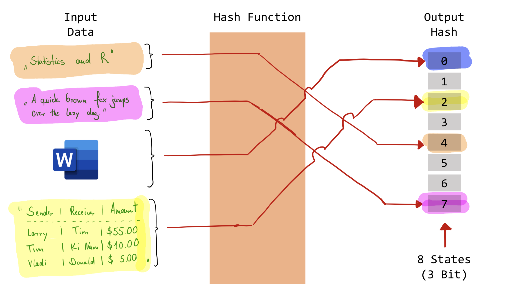

# Blockchain

```{r, echo=FALSE, fig.cap=NULL, out.width="70%"}
if (knitr::is_html_output()){
  knitr::include_graphics("gfx/gif/bitcoincorewalletsync.gif")
}
```

Cryptocurrencies, as we know them today, were introduced to the world with a whitepaper entitled ["Bitcoin: A Peer-to-Peer Electronic Cash System"](https://bitcoin.org/bitcoin.pdf) in 2008 by Satoshi Nakamoto. The paper promises nothing more than a decentralized, incorruptible database of monetary transactions that revolutionizes the concept of trust by eradicating third parties like banks, clearing agencies or lawyers. From there on the idea started to grow, spread widely and create enormous expectations so that the underlying technology - the blockchain - reached its peak of inflated expectations just before dropping hard with the bitcoin currency into the trough of disillusionment. While many papers have been written that discuss potential use cases and disruptive scenarios for the blockchain, very few actually understand the underlying working principles. While the basic idea is quite intuitive and easy to sell, the question of how blockchains actually work on a technical level is a bit harder to understand. Programming and developing a small demo blockchain is, however, the best way to understand the underlying technology and is a great programming exercise.

The goal of any blockchain is to store data in a decentralized and secure (meaning not manipulatable) way. In the case of cryptocurrencies, this data is usually multiple financial transactions between two parties. Obviously, the general principle is not limited to this use-case. As the word **block**-**chain** suggests, the construction principle is a chain of (data) blocks. However to understand what chains these portions of data we need to explain the concept of hash functions first. In order to know why and how people are participating in the creation of blockchains and why a blockchain focusses on security, the concept of a proof-of-work (PoW) algorithm needs to be discussed.

## Hash Functions
A hash function is any function that maps data of arbitrary size onto data of a fixed size. The values returned by a hash function are called hash values, hash codes, digests, or simply hashes. The most common application of hash functions is in cryptography. A cryptographic hash function allows verifying whether the input data maps onto a given hash value. However, when the input is unknown it is very difficult or (almost) impossible to reconstruct it from a given hash value. The following figure exemplarily illustrates the working principle of hash functions. The four inputs are mapped to one of the outputs. While the inputs show varying lengths (and can even be whole documents indicated by the word processor logo) the output is always a decimal number ranging from zero to eight (3-bit hash value).

```{r, echo=FALSE, fig.cap="Hash Function", out.width="100%"}

```

A common example of hash functions besides blockchains is storing passwords. When a user creates a user account his password is not kept in clear text, but the hash values are the only piece of information about the password saved in the data basis. Even if an attacker or hacker gains access to the database and manages to steal a copy of the information he can not log into a user's account, because the hash value is worthless to him and cannot be used to reconstruct the password. This is exemplified by the following R code, which uses the `SHA-256` algorithm to create hash values. Contrary to the simple example the hash value is not 3 but 256 bits long. The shown hash values are coded as hexadecimal values.

```{r}
library(digest) # Load package 'digest' that implements hash functions

accessGranted <- function(passwd){
  hash <- digest(passwd, algo = "sha256")
  databasis <- c("27f16d4aece13cf0443ebfd7deb7be198d0aa6adb637ca37b3c72f4fb2e01d7e",
                 "f92733254bac134a89313b489af49a20f8d0f76543824f503361ce3f92ca4d25",
                 "67f9a8c826a4e3d958d265b999030e85632cf2a2f65781cab08dfbe338f434f1")
  access <- hash %in% databasis
  return(access)
}

accessGranted(passwd = "uberpassword")     # Guess No. 1
accessGranted(passwd = "administrator")    # Guess No. 2

# Not even using a 'stolen' hash value as password helps
accessGranted(passwd = "27f16d4aece13cf0443ebfd7deb7be198d0aa6adb637ca37b3c72f4fb2e01d7e")
```

```{r, include=F, echo=F, eval=F}
# Passwords for the previous snippets:
digest("123456", "sha256")
digest("cswr", "sha256")
digest("root", "sha256")
```

Obviously, the main feature of cryptographic hash functions is their irreversibility, which is strongly dependent on the actual algorithm used to create the hash value. Making and breaking hash functions is an active area of research which has revealed many vulnerabilities and lead to some hashing algorithms being insecure. The algorithm used in the examples above is called "SHA-256" and is considered secure as of today (`r format(Sys.time(),"%d.%m.%Y")`). Other popular algorithms such as `MD5`or the algorithms used for storing Windows XP Passwords `LM-Hash` and `NTLM-Hash` are compromised and insecure, meaning that the hash value can be used to recover the password.

### Exercises {-}
```{r, echo=FALSE, fig.cap=NULL, out.width="100%"}
knitr::include_graphics("gfx/CH00-ExercisesHeader.png")
```

```{block2, type='rmdexercise'}
Can you find a password that causes the function `accessGranted` to return `TRUE`?
  
```

```{block2, type='rmdexercise'}
The ten most widely used passwords are *123456*, *123456789*, *qwerty*, *password*, *111111*, *12345678*, *abc123* and *1234567*. Which of these password produces the following `SHA-256` hash: 
  
`27f16d4aece13cf0443ebfd7deb7be198d0aa6adb637ca37b3c72f4fb2e01d7e`
  
```

## Blocks

After clarifying the basic concepts let us discuss the actual blockchain data. As mentioned earlier a block in the case of cryptocurrencies contains monetary transactions. However, as use cases vary so can the type of data stored into the blockchain. Using transactional data is only one example, it is, however, the most popular one. Additionally, to the transaction data a block needs to contain some additional information:

- Index: A number identifying the position of the block in the chain.
- Timestamp: The time at which the block was generated.
- Previous Hash: Hash value calculated over the last block.
- Hash: Hash value of the current block.
- Difficulty: Central parameter for the proof of work algorithm.
- Nonce: A number that can be randomly set; required for the proof of work algorithm.

Let us create the first block of the chain. This is usually called the genesis block. As it cannot contain a hash over previous blocks, the value for `previousHash` is set to `NULL`. 

```{r}
genesisBlock <- structure(list(
  index = 1,
  timestamp = Sys.time(),
  data = "Genesis",
  previousHash = NULL,
  difficulty = 0,
  nonce = 1,
  hash = NULL),class=c("block","list"))
```


For a nice printout on the console and a compact form of the following, we define the following printing function for our block. To keep the output compact even if long data objects are stored into the block, we suppress displaying the data by default. 

```{r}
print.block <- function(x, showdata=F){
  cat(":::::::::: BLOCKCHAIN BLOCK",x$index,":::::::::: \n")
  cat("Timestamp:", x$timestamp,"\n")
  cat("Previous Hash:", x$previousHash,"\n")
  cat("Difficulty:", x$difficulty,"\n")
  cat("Hash:", x$hash,"\n")
  if(showdata){
    cat("Data:","\n")
    print(x$data)
  }
}
```

Using a simple function, that concatenates the information from the given block and calculates a hash value we can complete the information needed for the block. 

```{r}
hashBlock <- function(block){
  block$hash <- digest(c(block$index,
                         block$timestamp,
                         block$data,
                         block$previousHash,
                         block$difficulty,
                         block$nonce), "sha256")
  return(block)
}

genesisBlockHashed <- hashBlock(genesisBlock)
genesisBlockHashed
```


## Proof of Work (PoW)

A proof of work algorithm is an economic measure designed to prevent service abuses, by presenting a puzzle (computational challenge) to the service requester. Solving this puzzle is usually difficult and/or time-consuming but a particular service is only granted if the right solution to the puzzle is presented. Therefore, a proof of work mechanism is an effective way to avoid too many requests to a service. The mentioned puzzle can be for example based on a random process with low probability so that a lot of trial and error is required before a valid solution can be found. However, while there are many random processes with low probability a proof of work needs to have a valid and verifiable solution. The most widely used proof of work system is called Hashcash and implemented into the Bitcoin protocol.

### Simple PoW Example {-}
For explanatory purposes, we start by using a simple proof of work system that is easy to understand and easily implementable. Remember that the work to obtain the proof must be feasible on the side of the service requester, but easy to check for the service provider. For our example, we require a service requester to find a number that is divisible by 99 and a given and previously known proof number, which can be done with the following two functions.

```{r}
# Calculate a new proof of work
proofOfWork <- function(lastProof){
  proof <- lastProof + 1
  while (!isProofValid(proof, lastProof)){
    proof <- proof + 1 # Increment proof by 1 until a valid solution is found.
  }
  return(proof)
}

# Check if a proof of work is valid
isProofValid <- function(proof, lastProof){
  return(proof %% 99 == 0 && proof %% lastProof == 0)
}
```

```{r}
P1 <- 1                             # Initial Proof
P2 <- proofOfWork(lastProof = P1)   # Second Proof
P3 <- proofOfWork(lastProof = P2)   # Third Proof
P4 <- proofOfWork(lastProof = P3)   # Fourth Proof
c(P1, P2, P3, P4)

```

While the example hopefully illustrates the principle, it must be kept in mind that this is not a proper proof of work algorithm. It can be easily seen that the sequence of proof numbers follows an identifiable pattern and thus can be calculated directly ( and not spending as much CPU time as desired for the solution).

```{r}
pvec <- 1                     # Initial Proof
for(idx in 1:10){
  pvec <- append(pvec,proofOfWork(pvec[idx]))
}
plot(x=1:length(pvec),y=pvec, 
     xlab="Steps of Proofs", ylab="Proof Number")
```

Additionally to the predictability of the proof numbers in the simple algorithm our example has numerous additional disadvantages that disqualify it for productive use. In the case of the Hashcash algorithm, the challenge is actually much more randomized and based on hash functions. The challenge is to generate hash values that contain a certain amount of leading zeros. Additionally, there needs to be a mechanism to account for growing computing power, so that new solutions to provided puzzles are found in approximately equal time slices. This in turns means that the difficulty of the puzzles needs to be adjustable.

### Combining PoW and Hashing {-}

A good proof of work algorithm for cryptocurrencies should not only be adjustable in terms of its difficulty but should also be random, so that it is not possible to predict its outcome and save computing power. It is therefore comparable to a lottery. A more in-depth example for a proof of work algorithm is shown in the following code snippet.

```{r}
proofOfWork <- function(block){
  hashedBlock <- hashBlock(block)
  targetHashBeginning <- paste0(rep(0, block$difficulty),collapse = "")
  while( !(substr(hashedBlock$hash,1,block$difficulty) == targetHashBeginning) ){
    hashedBlock$nonce <- hashedBlock$nonce + 1
    hashedBlock <- hashBlock(hashedBlock)
  }
  return(hashedBlock)
}
```

For a practical example let us use the genesis block that we just created as the starting point for our own blockchain and feed it to the new `proofOfWork` function after setting the difficulty to a moderate value.

```{r}
system.time(proofOfWork(genesisBlock))

genesisBlock$difficulty <- 3
system.time(proofOfWork(genesisBlock)) # Execute again with increased difficulty
```


### Exercises {-}
```{r, echo=FALSE, fig.cap=NULL, out.width="100%"}
knitr::include_graphics("gfx/CH00-ExercisesHeader.png")
```

```{block2, type='rmdexercise'}
Please explain the principle of the new and more complex `proofOfWork` function.

```


## Chaining Blocks

Due to the fact that the hash for each block considers not only the core information like index, timestamp and the data but also the hash of the previous block, applying the discussed process repeatedly leads to a chain of blocks. This chain is built on all information from all previous blocks due to the hashing process, meaning that one can only calculate the valid hash if one knows the correct and very easily verifiable hash from the block before. This leads to an unbreakable chain that proves the integrity of all information, changing prior information requires to recalculate all hashes. Let us put together what we learned and build our first block chain starting with the already generated genesis block.

```{r}
genesisBlockHashed
```

Let us assume that we received a single transaction request that needs to be included in the second block of the blockchain. The following transaction mimics the first bitcoin transaction, where 10.000 bitcoins were used to buy two pizzas at a Papa Johns restaurant. The next transaction is just another example that we can include in the third block to extend our chain a little more.

```{r}
transaction.b2 <- data.frame(Sender="Papa", Receiver="John", Amount=10000)
transaction.b2

transaction.b3 <- data.frame(Sender="Larry", Receiver="Tim", Amount=500)
transaction.b3
```

Using the function `addBlock` we can add the transaction to our blockchain.

```{r}
addBlock <- function(chain, newdata=NULL, difficulty=NULL){
  
  # Get Information from the existing chain
  blkidx <- sapply(chain, function(x)x$index)
  
  # Set difficulty conditional on user input
  if(is.null(difficulty)){
    dfc <- sapply(chain, function(x)x$difficulty)
    dfc <- dfc[which.max(blkidx)]
  } else {
    dfc <- difficulty
  }
  
  # Generate new block
  newBlock <- structure(list(
    index = max(blkidx) + 1,
    timestamp = Sys.time(),
    data = newdata,
    previousHash = chain[[which.max(blkidx)]]$hash,
    hash = NULL,
    difficulty = dfc,
    nonce = 1),class=c("block","list"))
  
  # Calculate Proof of Work and add block to the chain
  newBlockHashed <- proofOfWork(newBlock)
  chain <- append(chain, list(newBlockHashed))
  return(chain)
}
```

```{r}
chain <- list(genesisBlockHashed)                    # Intialize the Blockchain
chain <- addBlock(chain, newdata = transaction.b2)   # Add the transation data
chain <- addBlock(chain, newdata = transaction.b3)   # Add the transation data
chain                                                # Block Chain with 3 blocks
```

## Security

While it should now be already pretty clear that the data in the blockchain is not manipulatable without recalculating all hashes in the chain, we can look at a few examples of what happens when we manipulate information. Considering the discussed principles, we consider two possible manipulation attacks. First one can manipulate the data stored in the blockchain directly. The second approach that we analyze is the case where someone just inserts a block in the chain. We utilize the following two functions that use the hashes to check the integrity of the information of a block and analyze the linkage of the chain.


```{r}
verifyBlock <- function(block){
  rehashedBlock <- hashBlock(block)
  validHash <- rehashedBlock$hash == block$hash
  return(validHash)
}

verifyChain <- function(chain){
  actualHashes <- unlist(sapply(chain, function(x)x$hash))
  previousHashes <- unlist(sapply(chain, function(x)x$previousHash))
  hashesLinked <- previousHashes == actualHashes[-length(actualHashes)]
  if(!all(hashesLinked)){
    message("The provided chain is not linked at block index ", 
            which(!hashesLinked)," (link manipulation)!")
    return(all(hashesLinked))
  }
  blockVerification <- sapply(chain,verifyBlock)
  validChain <- all(blockVerification)
  if (any(!blockVerification)){
    message("The chain broke at block index ", 
            which(!blockVerification)," (block manipulation)!")
  }
  return(validChain)
}
```


```{r}
verifyBlock(chain[[2]])   # Check block 2 of the chain
verifyChain(chain)        # Check the entire chain
```

### Manipulation 1 {-}
As the entire information of the blockchain is freely available on the internet and everybody can download it, everybody can try to manipulate it as well. 

```{r}
# Manipulate amount for first transaction in block 2
evilchain <- chain
evilchain[[2]]$data$Amount[1] <- 9999 

verifyBlock(evilchain[[2]])
verifyChain(evilchain)
```

### Manipulation 2 {-}

Let us now inject a block that contains transactional data to steal money.

```{r}
evilBlock <- structure(list(
  index = 2,
  timestamp = Sys.time(),
  data = data.frame(Sender="Everyone", Receiver="Me!", Amount=5),
  previousHash = chain[[1]]$hash,
  difficulty = 0,
  nonce = 1,
  hash = NULL),class=c("block","list"))

evilBlockHashed <- hashBlock(evilBlock)

evilchain <- c(chain[1],list(evilBlockHashed),chain[3]) # Substitute block 2

verifyBlock(evilchain[[2]])
verifyChain(evilchain)
```

These examples hopefully help to clarify why the blockchain cannot be easily manipulated. Additionally to the already discussed measures, the blockchain is shared over a network. While it would be easy to manipulate a blockchain and recreate the linkage by re-hashing every block, this disregards the other participants in the system. When a new block is required, the necessary information is sent out to the network and every single participant. Everybody interested in participating can now try to solve the proof of work that is similar to the algorithm we implemented. The process of "finding" a new block by solving the computational puzzle is actually called mining and the goal in case of bitcoin is to generate one new block every 10 minutes (600 seconds). The participant who first solves the puzzle and submits a correct solution to the network is rewarded with bitcoins. Mining new blocks, therefore, creates new bitcoins. New blocks are sent out to all nodes in the network so that everyone has an up to date copy of the blockchain and can verify the results himself. This ensures that the power to create new blocks and bitcoins is and stays decentralized. While there are some more aspects regarding the security of the chain that deal with special properties of and attacks tailored to the network these techniques often exploit imbalances of the distribution of computing power in the network and are not discussed further. 


## Wrap up
In this session, we created a very small example of a (locally) functional blockchain. Obviously, all explanations are tailored to the goal of getting more in depth of the underlying technology and demystifying the whole thing. The programmed routines outline the basic principles that are also present in the real cryptocurrencies, however, to develop a fully functioning blockchain for production purposes one needs much more components like a client-server infrastructure, encryption of communication, wallets and much more. 

