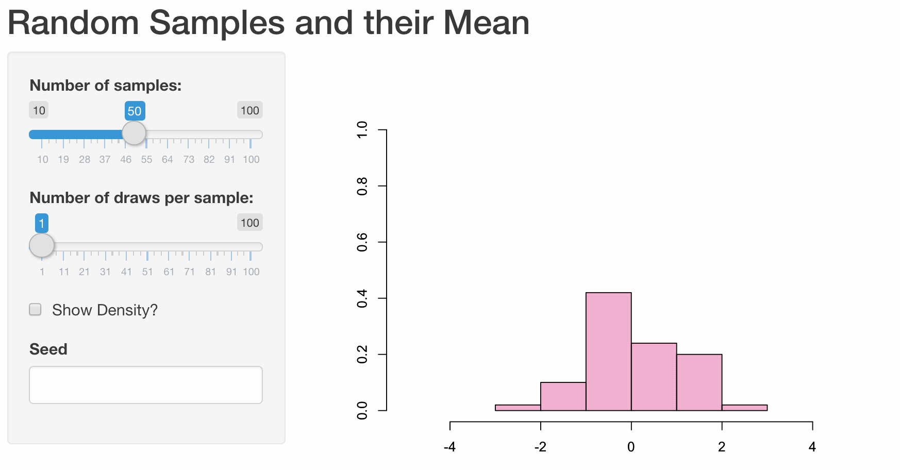
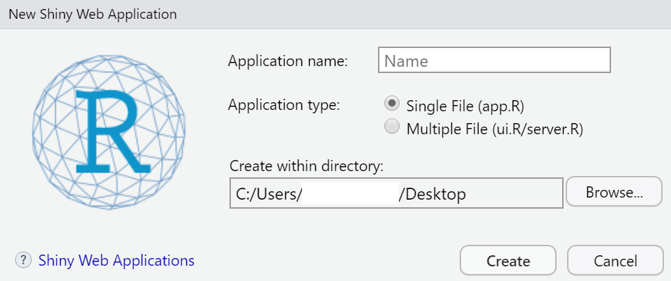
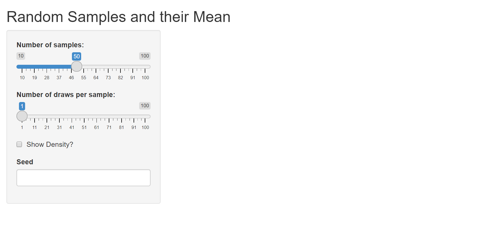

# Web Apps{#chapwebapps}

```{r, echo=FALSE, fig.cap=NULL, out.width="80%"}
if (knitr::is_html_output()){
  
}
```

To illustrate how web apps work we choose to visualize some well known, but for most people not very intuitive properties of the sample mean $\bar{X}$. While it is quite obvious that the expected value of the sample mean $E(\bar{X}) = E(\frac{1}{n}\sum_{i=1}^{n}X_i) = \mu$ is equal to the expected value of $X_i$, their variances differ.

Let us illustrate these properties using a plot. First, we are going to generate 1000 random draws $X_i$ from a standard normal distribution $N(\mu=0,\sigma^2=1)$ and plot a histogram to exemplify their probability density. We calculate the sample mean of five consecutive draws (`n <- 5`) and compare the probability density of these 200 (`N`) calculated means to the probability density of the initial draws. In order to compare the differences more clearly, we are also adding a density line for the empirical normal distribution.

```{r}
# Make results comparable
set.seed(100)

# Draw random numbers and calculate N means based on n draws
n <- 5
N <- 200
rngmat <- matrix(rnorm(n*N), nrow = n, ncol=N)
meanvec <- apply(rngmat, 2, mean)

# Plot histograms 
MASS::truehist(rngmat, col=rgb(0,0,1,1/6),xlim=c(-5,5),ylim=c(0,1),xlab="")
par(new=T) # Necessary to combine two histograms in one plot
MASS::truehist(meanvec,col=rgb(1,0,0,1/4),xlim=c(-5,5),ylim=c(0,1),xlab="")

# Add empirical probability density as line
xseq <- seq(-5,5,length.out = 1000)
y <- sapply(xseq, function(x){dnorm(x, mean(rngmat),sd(rngmat))})
ymean <- sapply(xseq, function(x){dnorm(x, mean(meanvec),sd(meanvec))})
lines(xseq, ymean, type="l",col="red")
lines(xseq, y, type="l", col="blue")
```

Obviously, the shown plot is dependent on the number of draws that are used for every calculation of a mean `n` and the total number of means that we want to calculate `N`. Additionally, we can make the user decide whether he wants the density lines in the plot and if the random numbers are drawn using a seeded random number generator for which a seed can be provided. Every time one of these four inputs changes the plot needs to be recreated. A very convenient way to make our small program accessible by users that have little or no experience using R, we can transform our script into a web app using the `shiny`-package.

A shiny app can be easily build using three simple components: a page constructor, a server script, and app constructor. The page constructor creates the user interface meaning it provides a mechanism for users to input values for variables and displays results. The server script takes the inputs from the user interface, performs calculations and returns the output for the user interface. The app constructor links the user interface and the server script and coordinates everything. The general structure of a shiny app in the required form is as shown in the following snippet.

```{r, eval =FALSE}
library(shiny)

# Define UI for application that draws a histogram
ui <- fluidPage(

    titlePanel("Title"),

    sidebarLayout(
        sidebarPanel(
           ## Input
        ),
        mainPanel(
           ## Output
        )
    )
)

server <- function(input, output) {
      ## Actual R Script 
}

shinyApp(ui = ui, server = server)
```


```{r, eval=F}
# Shiny Example for the CSWR Course

library(shiny)

# Define UI for application that draws a histogram
ui <- fluidPage(

    # Application title
    titlePanel("Random Samples and their Mean"),

    # Sidebar with a slider input for number of bins 
    sidebarLayout(
        sidebarPanel(
            sliderInput("N",
                        "Number of samples:",
                        min = 10,
                        max = 100,
                        value = 50),
            sliderInput("n",
                        "Number of draws per sample:",
                        min = 1,
                        max = 100,
                        value = 1),
            checkboxInput("showdensity", 
                          "Show Density?", 
                          value = FALSE),
            numericInput("seed", "Seed", 
                         value=NULL, 
                         min = 0, 
                         max = 10000, 
                         step = 1)
        ),

        # Show a plot of the generated distribution
        mainPanel(
           plotOutput("distPlot")
        )
    )
)

# Define server logic required to draw a histogram
server <- function(input, output) {

    output$distPlot <- renderPlot({
        
        if(!is.na(input$seed)) set.seed(input$seed)
        rngmat <- matrix(rnorm(input$n*input$N), nrow = input$n, ncol=input$N)
        meanvec <- apply(rngmat, 2, mean)
        
        xseq <- seq(-5,5,length.out = 1000)
        y <- sapply(xseq, function(x){dnorm(x, mean(rngmat),sd(rngmat))})
        ymean <- sapply(xseq, function(x){dnorm(x, mean(meanvec),sd(meanvec))})
        
        ymax <- ceiling(max(c(y,ymean)))
        ymax <- ifelse(is.finite(ymax),ymax, 1)
        
        MASS::truehist(rngmat, col=rgb(0,0,1,1/6),xlim=c(-5,5),ylim=c(0,ymax),xlab="")
        if(input$showdensity) lines(xseq,y,type="l",col="blue",lwd=2)
        par(new=T)
        MASS::truehist(meanvec,col=rgb(1,0,0,1/4),xlim=c(-5,5),ylim=c(0,ymax),xlab="")
        if(input$showdensity) lines(xseq,ymean,type="l",col="red",lwd=2)
        

    })
}

# Run the application 
shinyApp(ui = ui, server = server)

```


In the following we will take a closer look at

+ how we can generate a *new* shiny app in general (which R files we need, etc.). 

+ the elements the UI and the server of a shiny app consist of and how they are connected to each other.


The main references for constructing *shiny web apps* are 

+ the functions' descriptions of `shiny` [@shiny],

+ the `shiny` Cheat Sheet [@shinyCheatsheet] and

+ the [Shiny Gallery](https://shiny.rstudio.com/gallery/) [@ShinyGallery].


## Introduction

When we want to create a Shiny Web App, we start in RStudio by clicking on: `File` $\rightarrow$ `New File` $\rightarrow$ `Shiny Web App...`

Then a window opens like in figure \@ref(fig:start-shiny-web-app). It shows a field in which we have to type in a name for the app and we have to choose whether a single file (app.R) or two separate files (ui.R and server.R) will be created (Of course, then we click on `Create`.). In both cases, a folder will be generated whose name is the one we typed in the field *Application name*. The name(s) of the file(s) does (do) not change.

```{r start-shiny-web-app, fig.cap = "Creating a new shiny web app.", echo=FALSE}

```

Independently of the number of files (app.R or ui.R and sever.R) we have chosen, when we click `Run App` (see figure \@ref(fig:start-shiny-web-app2)), a new window opens which shows the user interface of an exemplary shiny web app dealing with the `faithful` data set [@R]. **Try it out!**

```{r start-shiny-web-app2, fig.cap = "Running a shiny web app that is predefined when a new shiny web app is created in RStudio.", echo=FALSE}
knitr::include_graphics("gfx/start_Shiny_App2.png")
```

Basically, it makes no great difference whether a shiny web app is implemented within one file or whether two files are used. Since we will create relatively *small* shiny web apps (not much code) we will implement the code in the `app.R`-file.

In order to implement a user interface we will use predefined functions that are nested and are organized in a predefined layout (e.g. `fluidPage()`; see code below). [@shinyCheatsheet] The nested code of the UI (which is a HTML document) is saved as `ui`. [@shinyCheatsheet] In order to tell the server how the user interface has to be built and updated we create a function named `server()`. [@shinyCheatsheet] 

```{r, eval=FALSE}
library(shiny)
ui <- fluidPage()
server <- function(input, output){}
```

The UI (`ui`) and the server function (`server()`) are connected to each other by calling [@shinyCheatsheet]:

```{r, eval=FALSE}
shinyApp(ui = ui, server = server) # see shiny Cheat sheet (RStudio, Inc. 2015)
```


In the following, we will see how `ui` and `server()` have to be defined in order to create the shiny app *Random samples and their Mean* from the beginning of this chapter \@ref(chapwebapps).

## ui (user interface)

The user interface of the Shiny app *Random samples and their Mean* (see above) consists of

1. the title "Random samples and their Mean",

2. a slider to control the number of samples,

3. a slider to control the number of draws per sample,

4. a box to tick whether the (empirical) density will be shown,

5. a field in which to type in a number to set a random seed and

6. a plot that is updated when the input (2.--5.) changes. 


The elements 2.--5. - the user interacts with -  are organized in a sidebar (one element on top of the other) and the plot (6.) is on the right side of the sidebar.


The `shiny` Cheat Sheet reveals how the listed elements can be implemented:
For the creation of the elements 2.--5. we use the functions listed on the `shiny` Cheat Sheet under *Inputs* [@shinyCheatsheet, p. 1]:

element of the exemplary UI   | implementation in `shiny` [@shiny]
------------------------------|---------------------------
slider to control the number of samples (2.) | `sliderInput()`
slider to control the number of draws per sample (3.) | `sliderInput()`
box to thick whether the (empirical) density shall be shown (4.) | `checkboxInput()`
field in which to type in a number to set a random seed (5.) | `numericInput()`


We also have to specify the layout. For this, we take a look at the second page of the Shiny Cheat Sheet [@shinyCheatsheet] under *Layouts*:

There, the function `sidebarLayout()` is listed. It consists of the functions `sidebarPanel()` and `mainPanel()` that realize a sidebar and a field next to it, respectively. In the *main panel* the plot of our shiny web app **shall** be shown but it will not happen as long as we have not defined an *appropriate* `output()` function that allows showing plots. For this, the function `plotOutput()` exists [@shinyCheatsheet, p. 1, *Outputs*].

The title will be added in form of an extra panel based on the function `titlePanel()` [@shiny]. Any element that is not specified within a layout function will be presented either above or underneath the defined layout as the title which is presented above the defined layout.

The ideas listed so far result in the following code:

```{r, eval=FALSE}
ui <- fluidPage(

  # Application title
  titlePanel("Random Samples and their Mean"),

  # Sidebar with 
  sidebarLayout(
    sidebarPanel(
      sliderInput(), # a slider input for number of sample
      sliderInput(), # a slider input for number of draws per sample
      checkboxInput(), # box to tick whether the (empirical) density will be shown
      numericInput() # a field in which to type in a number to set a random seed
    ),
    mainPanel(
      plotOutput() # plot that is updated when the input(s) change(s)
    )
  )
  
)
```


The code presented does not work since several arguments of the single functions have not been defined so far (see the description of the single functions and @shinyCheatsheet). One of these arguments is an *Id*; each *Input*- and *Output*-function needs an *Id* to address the corresponding element (e.g. to access values). [@shinyCheatsheet]

Furthermore, 

+ we have to set the values of the single *Inputs* (e.g. a range of values from which the user can choose values),

+ we will define default values and

+ we will label the elements

which is shown in the following:

```{r, eval=FALSE}
ui <- fluidPage(

  # Application title
  titlePanel("Random Samples and their Mean"),

  # Sidebar with a slider input for number of bins
  sidebarLayout(
    sidebarPanel(
      sliderInput("N",
                  "Number of samples:",
                  min = 10,
                  max = 100,
                  value = 50),
      sliderInput("n",
                  "Number of draws per sample:",
                  min = 1,
                  max = 100,
                  value = 1),
      checkboxInput("showdensity",
                    "Show Density?",
                    value = FALSE),
      numericInput("seed", "Seed",
                   value = NULL,
                   min = 0,
                   max = 10000,
                   step = 1)
    ),

    # Show a plot of the generated distribution
    mainPanel(
      plotOutput("distPlot"))
  )
)
```

From this code we see that

+ "N", "n", "showdensity" and "seed" (the first argument of the Input functions) are the corresponding *Id*s,

+ the second argument represents the labeling (some text placed above or next to the elements in the UI),

+ the argument `value` represents the default value and

+ the arguments `min` and `max` are the minimum and maximum, respectively, of a range of values.

Look at further *Input*-functions: There might be further arguments to specify.


What happens when the ui is defined, the server looks like this

```{r, eval=FALSE}
server <- function(input, output) {}
```

and the app is run by

```{r, eval=FALSE}
shinyApp(ui = ui, server = server)
```

?

The shiny web app looks like this:

```{r shiny-web-only-ui, fig.cap = "Running the shiny web app when only the UI is defined.", echo=FALSE}

```

So, the user can choose values and click on the checkbox, but nothing will happen. Consequently, we need to define the server function.

## server

To every element - we have defined as an output on the ui - belongs an
appropriate `render*()` function to generate the corresponding element (e.g. a plot) (see the `shiny` Cheat sheet). [@shinyCheatsheet]
Defining the different types of outputs like plots, tables etc. works *in general* like this:

```{r, eval=FALSE}
output$Id_Output <- renderFunction({
...
}) # see shiny Cheatsheet (RStudio, Inc. 2015) 
```

where `Id_Output` is the *Id* of the output we defined in the UI, e.g. `distPlot` is the id of the plot we will create:

```{r, eval=FALSE}
output$distPlot <- renderPlot({
  ...
})
```

In the server function, we can also access values of the inputs on the ui by calling `input$Id_Input` where `Id_Input` is the *Id* of the element we have defined as input, e.g. `seed` is the *Id* of the numeric Input where the user sets a number for a random seed [@shinyCheatsheet, p. 1]:

```{r, eval=FALSE}
output$distPlot <- renderPlot({
  ...
  if(!is.na(input$seed)){ # if a number has been set to define a random seed then ...
    set.seed(input$seed)
  }
  ...
  })
```

Here is an overview of more *pairs* of `render*()`- and `*Output()`-functions extracted from [@shinyCheatsheet]:

`render*()`-function | `*Output()`-function
---------------------|---------------------
`DT::renderDataTable()` | `dataTableOutput()`
`renderImage()` | `imageOutput()`
`renderPlot()` | `plotOutput()`
`renderPrint()` | `verbatimTextOutput()`
`renderTable()` | `tableOutput()`
`renderText()` | `textOutput()`
`renderUI()` | `uiOutput()` \& `htmlOutput()` 


Based on this knowledge the server function is defined:

```{r, eval=FALSE}
server <- function(input, output) {

  output$distPlot <- renderPlot({

    if(!is.na(input$seed)) set.seed(input$seed)
    rngmat <- matrix(rnorm(input$n*input$N), nrow = input$n, ncol=input$N)
    meanvec <- apply(rngmat, 2, mean)

    xseq <- seq(-5,5,length.out = 1000)
    y <- sapply(xseq, function(x){dnorm(x, mean(rngmat),sd(rngmat))})
    ymean <- sapply(xseq, function(x){dnorm(x, mean(meanvec),sd(meanvec))})

    ymax <- ceiling(max(c(y,ymean)))
    ymax <- ifelse(is.finite(ymax),ymax, 1)

    MASS::truehist(rngmat, col=rgb(0,0,1,1/6),xlim=c(-5,5),ylim=c(0,ymax),xlab="")
    if(input$showdensity) lines(xseq,y,type="l",col="blue",lwd=2)
    par(new=T)
    MASS::truehist(meanvec,col=rgb(1,0,0,1/4),xlim=c(-5,5),ylim=c(0,ymax),xlab="")
    if(input$showdensity) lines(xseq,ymean,type="l",col="red",lwd=2)


  })
}
```

Finally, running the app leads to the result illustrated in the gif in the beginning of this chapter \@ref(chapwebapps).


## Exercises {-}
```{r, echo=FALSE, fig.cap=NULL, out.width="100%"}
knitr::include_graphics("gfx/CH00-ExercisesHeader.png")
```

### From June 21, 2022 {-}

```{r, echo=FALSE, fig.cap=NULL, out.width="100%"}
knitr::include_graphics("exercises/web_apps/cswr_programming_R_appl_shiny_web_apps.pdf")
```

| Description | File | 
| :---: | :--------:   |
| `shiny` web app (R-Datei)|  [app.R](exercises/web_apps/app.R) |


