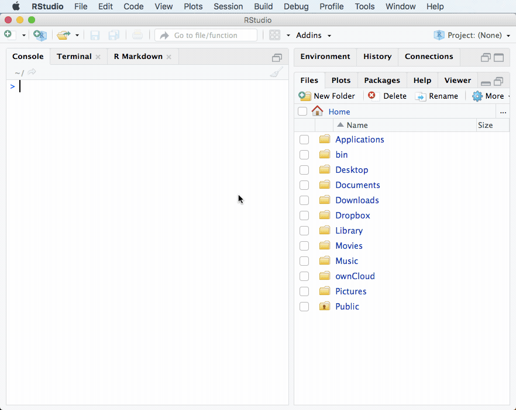
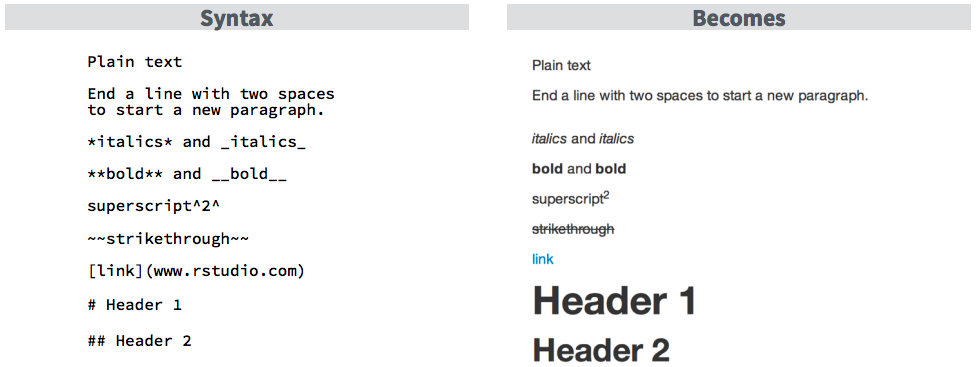
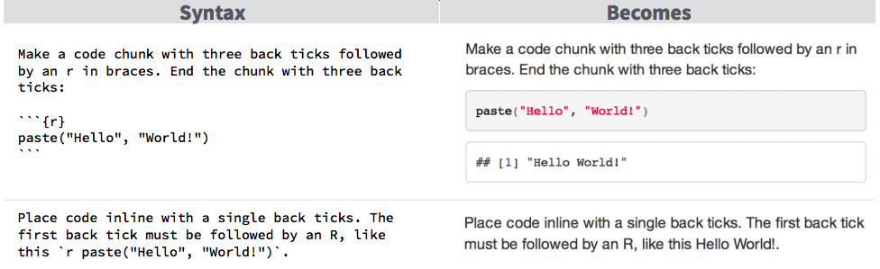

# RMarkdown

## Installation of Latex and RMarkdown {-}
In order to produce PDFs which is often required, RMarkdown asks you to install a few packages within R. Additionally, you also need a Latex-Distribution, which is the language into which R Markdown translates everything right before creating the PDF. The following lines of code perform the required steps and should be pursued if you have not already a working latex installation.

```{r, eval=FALSE}
# 1. Install required R packages
install.packages(c('tinytex', 'rmarkdown', 'knitr'))

# 2. Install Latex distribution
tinytex::install_tinytex()

# 3. Restart RStudio manually (!)
# Restarting R manually is not enough, the RStudio window needs to be closed!

# 4. Verify installation
tinytex:::is_tinytex()
```

If you already installed a fully blown Latex distribution you should **ensure that latex packages are installed on the fly** if required. Otherwise, the creation of the PDFs may fail due to missing packages and the missing interoperability between the latex and RStudio console won't display an error message. If you for some reason want to install a full latex distribution be sure to download and install one of the following recommendations:

- **Windows:** https://miktex.org/download
- **MacOS:** http://www.tug.org/mactex/
- **Linux:** http://www.tug.org/texlive/

After you installed a Latex distribution and the RMarkdown package you should be able to test if you can create PDFs by using the example document. This can be reached by File -> New File -> RMarkdown -> PDF and OK. After a click on the **Knit** Button, the PDF will be produced and weaves together the containing text, R code, and graphics.

```{r, echo=FALSE, fig.cap=NULL, out.width="70%"}
if (knitr::is_html_output()){
  
}
```

## Syntax {-}
Markdown has its own syntax that needs to be followed in order to produce nice looking documents. While we have already seen some of these things in the example sheet, the following gives a very brief overview of frequently used commands. The first few lines of an `*.Rmd` document always set the scene for the whole document. For the beginning, it is okay to go along with the produced output from the sample document. These commands are written in **Y**et **A**nother **M**arkup **L**anguage (YAML) and a standard YAML header looks like this.

```{r, eval=F, highlight=F}
---
title: "Statistics 101"
author: "Benjamin Buchwitz"
date: "`r Sys.Date()`"
output: pdf_document
---
```

This header can be extended and some of these arguments can be manipulated to change the general settings for the document. To create an e.g. document with a table of contents (TOC) that shows two sublevels and contains numbered sections the header can be equipped with the following arguments additional to the usual `output` argument.

```{r, eval=F, highlight=F}
...
output:
  pdf_document:
    toc: true
    toc_depth: 2
    number_sections: true
---
```

To actually control the appearance of text and set different text types Markdown supports some basic commands. Most of them are somehow present in any word processor like Microsoft Word, where sections and subsections also can be defined by the predefined text types. Markup is quite similar, but of course, does not support clicking. As the central idea of markup is to always combine things (like code, etc.) and still have one readable document, the commands are quite minimalistic and look like this.

```{r, echo=FALSE, fig.cap="RMarkdown Examples", out.width="70%"}

```

If you want to produce normal text you can just type it in without any leading characters or additional commands or comment characters. A lot of additional features for text, code chunks, and options for the header are listed in this [Cheat Sheet](https://www.rstudio.com/wp-content/uploads/2015/03/rmarkdown-reference.pdf).

## Embedding R {-}
A major advantage of RMarkdown is the possibility to embed and execute R code so that documents can be used to combine programs and explanations and solve programming assignments in a single document or create dynamic reports. There are two possibilities to embed R into a document - code blocks and inline code. Both are explained in the linked Cheat Sheet above.

```{r, echo=FALSE, fig.cap="RMarkdown R Code", out.width="70%"}

```

## Equations {-}

Additionally, to combining text and code, R Markdown supports usage of equations using Latex-Notation. Blocks that contain Latex-Code can be opened and closed either by the single or double dollar sign. While the `$` creates inline equations like $\bar{x}=\sum_{i=1}^{n}x_i$. The equation for the arithmetic mean is generated using the following `\bar{x}=\sum_{i=1}^{n}x_i`. The same code put in double dollar signs (`$$`) produces the following block.

$$\bar{x}=\sum_{i=1}^{n}x_i$$

Commands in Latex are always preceded by a backslash as we have just seen. The simplest commands produce just a symbol, but these can then be combined to form equations and more complex expressions. Some commands take additional arguments or combine things placed inside of curly braces. The following shows some examples of basic mathematical expressions that you may want to use.

| Output                            | Latex                           | 
|:----------------------------------|:--------------------------------|
| $A \cup B$                        |  `A \cup B`                     | 
| $A \cap B$                        |  `A \cap B`                     | 
| $x \in A$                         |  `x \in A `                     | 
| $5 \pm 2$                         |  `5 \pm 2 `                     | 
| $\log(x)$                         |  `\log(x) `                     | 
| $\sin(x)$                         |  `\sin(x) `                     | 
| $\hat{x}$                         |  `\hat{x}`                      | 
| $\sqrt{x}$                        |  `\sqrt{x}`                     | 
| $\overline{x}$                    |  `\overline{x}`                 | 
| $\frac{k}{n}$                     |  `\frac{k}{n}`                  | 
| $\binom{k}{n}$                    |  `\binom{k}{n}`                  | 
| $\frac{\partial f}{\partial x}$   |  `\frac{\partial f}{\partial x}`| 
| $x^2$                             |  `x^2`                          |
| $x_2$                             |  `x_2`                          |
| $\lim_{x\to\infty}$               |  `\lim_{x \to \infty}`          |
| $\int_0^{\infty} f(x) \; dx$      |  `\int_0^{\infty} f(x) \; dx`   |


Additionally, to all the symbols and mathematical expressions, the whole greek character set is provided by Latex. If you are not familiar with these characters the following table gives an overview and is a good starting point to learn some additional symbols to complement the usual $\alpha$, $\beta$ or $\mu$.


| Name        | Symbol                | Latex             | 
|:------------|:---------------------:|:------------------| 
| alpha       | $\alpha \ A$          | `\alpha A`        | 
| beta        | $\beta \ B$           | `\beta B`         |
| gamma       | $\gamma \ \Gamma$     | `\gamma \Gamma`   |
| delta       | $\delta \ \Delta$     | `\delta \Delta`   |
| epsilon     | $\epsilon \ E$        | `\epsilon E`      |
| (epsilon)   | $\varepsilon$         | `\varepsilon`     |
| zeta        | $\zeta \ Z$           | `\zeta Z`         |
| eta         | $\eta \ H$            | `\eta \Eta`       |
| theta       | $\theta \ \Theta$     | `\theta \Theta`   |
| iota        | $\iota \ I$           | `\iota I`         |
| kappa       | $\kappa \ K$          | `\kappa K`        |
| lambda      | $\lambda \ \Lambda$   | `\lambda \Lambda` |
| mu          | $\mu \ M$             | `\mu M`           |
| nu          | $\nu \ N$             | `\nu N`           |
| xi          | $\xi \ \Xi$           | `\xi \Xi`         |
| omicron     | $\omicron \ O$        | `\omicron O`      |
| pi          | $\pi \ \Pi$           | `\pi \Pi`         |
| rho         | $\rho \ P$            | `\rho P`          |
| sigma       | $\sigma \ \Sigma$     | `\sigma \Sigma`   |
| tau         | $\tau \ T$            | `\tau \Tau`       |
| upsilon     | $\upsilon \ Y$        | `\upsilon Y`      |
| phi         | $\phi \ \Phi$         | `\phi \Phi`       |
| (phi)       | $\varphi$             | `\varphi`         |
| chi         | $\chi \ X$            | `\chi X`          |
| psi         | $\psi \ \Psi$         | `\psi \Psi`       |
| omega       | $\omega \ \Omega$     | `\omega \Omega`   |

