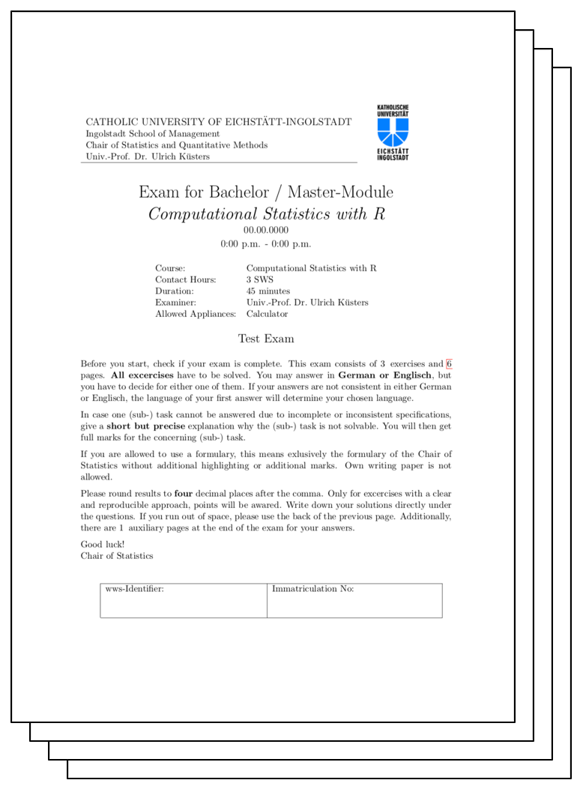

# Test Exam

```{r, echo=FALSE, fig.cap=NULL, out.width="50%"}

```


| Description                       | Download Link                            |
|:----------------------------------|:----------------------------------------:|
| Test Exam SS 2019                 | [DOWNLOAD](./data/CSWR-TestExam2019.pdf)|

## Additional Exercises

### Exercise I
The following function `makemat` was found in the file `function.final.final2.R` as part of an old undocumented project. Therefore its purpose is unknown. Being a young and ambitious R developer you were asked to answer the following questions.

```{r}
set.seed(124)
num <- round(runif(9, min = 0, max = 0.6), 2)
num
```

```{r, eval=FALSE}
kat <- c(1, 2, 3)
val <- c(0.2, 0.4, 0.6)
mat <- matrix(num, ncol = 3, nrow = 3)

for ( i in 1:prod(dim(mat)) ){
  for ( j in val){
    state <- (mat[i] < j)
    if (state){
      mat[i] <- kat[j == val]
    }
  }
}
  
mat[(mat % 2) == 1] <- 1

mat
```


a) While executing and trying to load the function above the following message appears. Explain why the message is returned and correct the error in the provided source code.

    `Error: unexpected input in "mat[(mat % 2) == 1] <- 1"`

b) Make yourself familiar with the provided code and briefly describe in a generic way what the code does (line-by-line, one full iteration of the outer loop). Ensure that your description is short but precise and allows the reader to gain a deep understanding of the data manipulation process. 
c) Write down the content of the variable `mat` after fixing the error and executing the code above.


## Exercise II 
The following three code snippets were found in the file `misc.support.final.final2.R` as part of an old undocumented project. Therefore their purpose is unknown. Being a young and ambitious R developer you were asked to explain the mysterious content of the following three snippets.

```{r, eval=FALSE}
### CODE SNIPPET 1
x <- 100
counter <- 0

while( x > 0){
 x <- x/2
 counter <- counter + 1
}

counter
```

a) Briefly describe what the code snippet above does (line-by-line).
b) Please give your opinion on the provided code and comment on time of execution.

```{r, eval=F}
### CODE SNIPPET 2
res <- list()

for (i in 1:10){
  res[[i]] <- sample(seq(from=0,to=1,by=0.2))
}

sum(sapply(res,FUN = sum))
length(res)
typeof(res[[1]][1])
```

c) Please write down what the last three lines of code snippet 2 return when executing the code above.

```{r, eval =FALSE}
### CODE SNIPPET 3
a <- array(sort(rep(1:3,4)),dim=c(2,2,3))

for ( i in 1:dim(a)[1] ){
  for ( j in 1:dim(a)[2] ){
    for ( k in 1:dim(a)[3] ){
      a[i,j,k]  <- ifelse(a[i,j,k] %% 2, a[i,j,k], NA)
    }
  }
}

a
```

d) Please write down the content of the variable `a` when snippet 3 is executed.

### Exercise III
The following function `genlist` was found in the file `list-maker.final.final2.R` as part of an old undocumented project. Therefore its purpose is not known. Being a young and ambitious R developer you were asked to answer the following questions.

```{r, eval=FALSE}
genlist <- function(x=sample(x=1:5, size=5)){
  n <- 0
  for (i in (1:length(x))){
    if (x[i] % 2 == 1){
      n <- n + 1
    }
  }
  res <- list(n=n, x=x, y=rev(x), z=sort(x))
  return(res)
}
```

a) While executing and trying to load the function above the following message appears. Explain why the message is returned and correct the error in the provided source code.

    `Error: unexpected input in:`
    
    `"  for (i in (1:length(x))){`
    
    `    if (x[i] % 2 == 1){"`

b) Briefly describe what the function `genlist` does (line-by-line) and returns. Ensure that your description is precise and allows the reader to gain a deep understanding of how the values in the returned list are generated.

c) Provide the results to the following function call based on your corrected code.

```{r, eval=FALSE}
genlist()
genlist(1:7)
```

d) Please come up with a single line of code that returns the type of each list element. Name the respective datatypes and answer the question if these can be different from values returned by `class`.
